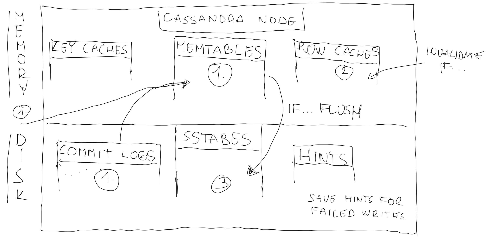
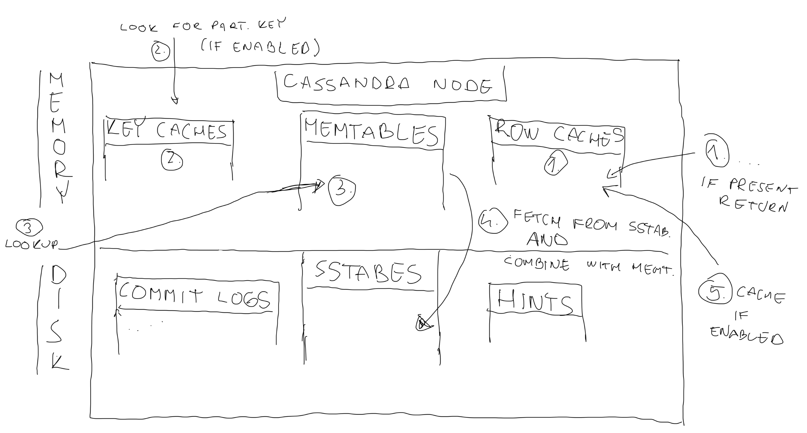
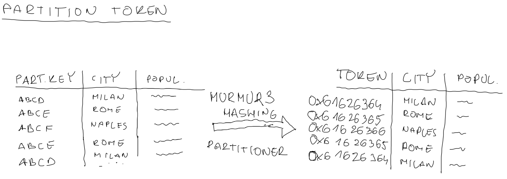
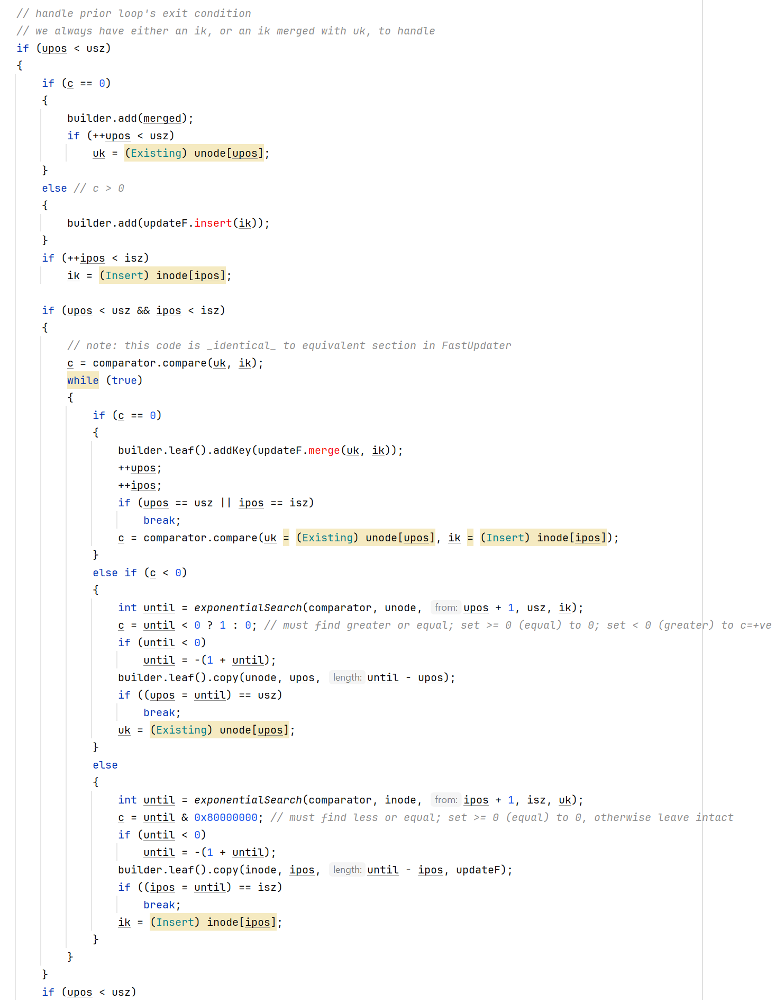
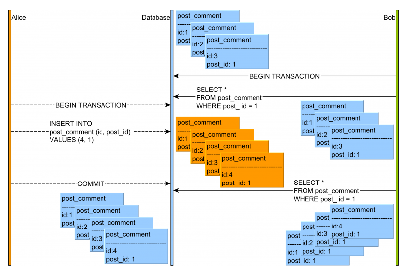

# Cassandra & MongoDB  

  


> ***"Mélységes mély a múltnak kútja. Ne mondjuk inkább feneketlennek?"***  

## Mi az igazság?! Avagy mit gondolnak a fórumozó emberek..

 
> ***"MongoDB is good. It works. However, it’s a somewhat specialized tool solving a somewhat specialized problem extremely well. It doesn’t solve all problems. Other problems are better solved with other data storage engines."***  

> ***"A very observant person could also point out that Facebook uses MySQL in a way that isn't too dissimilar sharding a NoSQL database and leveraging Memcache on top of it"***  

> ***"MongoDB was known to be less reliable because it didn't support ACID transaction semantics in the early days. This has changed since they acquired WiredTiger and use its WiredTiger storage engine. Today, from the transaction perspective, MongoDB is as solid as Postgres"***  <https://www.bytebase.com/blog/postgres-vs-mongodb>   


> ***"Performance is primarily determined by the access pattern. If an operation involves different entities, MongoDB is usually faster because data is de-normalized and doesn't require costly joins between tables. On the other hand, Postgres is more capable of handling complex queries thanks to SQL and its sophisticated query optimizer."***  
<https://www.bytebase.com/blog/postgres-vs-mongodb>  

  
> ***"Because of the way Cassandra is architectured, it's extremely good at certain use cases and extremely bad at others! I have used it in the past in various projects with great success. In particular, we had a project in King where our system had to support around 1,000,000 requests per second from all around the world. Cassandra could handle that without breaking a sweat. Good luck doing that with another database."***  

> ***"Basically, whenever you see something being "more scalable", "100 times faster" or anything like that, it's usually by sacrificing other types of operations, and/or making data operations far less safe."***  

  
From: <https://www.redwolf.in>  

> ***"With great power there must also come great responsibility"***  
- [ ] Careful maintenance 
- [ ] Good understanding of how Cassandra works internally
- [ ] Maintain your data integrity and consistency 
- [ ] Analysing your cluster topology and running repair operations frequently

## Megjegyzés
- [ ] Nem feltétlenül csak egy-egy konkrét eszköz  
- [ ] Jelen témától viszonylag független és hasznos tudáshalmaz is

## Zipped  
  

 - [ ] Apache Cassandra® is a free and open-source, distributed, wide column store, NoSQL database management system written in Java designed to handle large amounts of data across many commodity servers, providing high availability with no single point of failure.
 A Cassandra cluster is made up of multiple nodes. Cassandra nodes typically run on Linux® ​​and the only requirement to participate in a cluster is that the nodes are able to communicate with one another via a few well-known TCP/IP ports.

 - [ ] MongoDB is a free and open-source cross-platform document-oriented database program. Classified as a NoSQL database program, MongoDB uses JSON-like documents with schemata.

## Snippets

>    **Document-oriented** & **Wide column store**  
>    
>    **scooter** & **car**

_Sok idő kellett a felismerésig.._  
- [ ] Hasonló építőelemek és koncepciók, főleg a WiredTiger óta
- [ ] Szervezeti szinten közösek az ősök (MongoDB/WiredTiger) 
- [ ] Valamilyen szinten azért függetlenek is
- [ ] Pl. WiredTiger: BTree + LSM tree  


>  **..., or write your own**  
- [ ] Felelősség is  
   

 
## Előszó a Cassandrához

- [ ] Átlátni a világ nyolcadik csodáján  
- [ ] Datastax (Astra)?  Cassandra?  
- [ ] Jelenleg Cassandra 5.0, de  BETA1 verzió. Eme verzió egy v
- [ ] Viszonylag nagy mérföldkő
- [ ] Bumeráng hatás
- [ ] ACID
- [ ] Historia est magistra vitae
- [ ] Pehelysúlyú tranzakció, kötegelt utasítás végrehajtás.. $$$
- [ ] "From startups to the largest enterprises, the world runs on Cassandra"
- [ ] Monzo: Tranzakció? +ügyfél/pénzügyi adatok
- [ ] Mutex, row level atomicity: Ellentmondás..  

> Cassandra doesn’t provide – Doesn’t have kind of acid transactions like that. So you kind of
need to do that yourself. So we at Monzo, we actually use etcd for that, which is another
distributed key-value store which runs – We run it in memory.   

- [ ] Failover, locking, etc.


## Előtörténet, hogyan alakultak ki  
  

### Cassandra
  
> - Trójai papnő  
> - Apollo: prófétálás képessége
> - Akik jövendőmondásai teljesen hiteltelennek hatnak mások szemében, de..
> - Átok által sújtott Jós (Oracle)

			
Avinash Lakshman (Amazon's Dynamo), Prashant Malik  
**facebook** for inbox search feature
 - [x] 2008 -> Open-source project
 - [x] 2009 -> Apache Incubator project
		

### MongoDB
Most popular NoSQL database system
Developed by MongoDB Inc.  
Published: combination of the Server Side Public License and the Apache License
 - [x] 2007:  by **10gen** -> a component of a planned platform as a service product
 - [x] 2009: shifted to an open source development model
	

## Hol használjak őket?
### Cassandra 
 - [ ] Monzo (~Revolut)
 - [ ] ING Bank
 - [ ] OTP financial transactions 
 - [ ] Zipkin  
### MongoDB
 - [ ] MetLife
 - [ ] UPS
 - [ ] New York Times


### Kiegészítés a Cassandra használatát illetően

**Ideal Cassandra use-case:**
 - [ ] Writes >> reads
 - [ ] Rare, idempotent updates
 - [ ] Read: by known key(s)
 - [ ] Evenly partitionable via (a) key(s)
 - [ ] No join/aggregation
  
**Good use cases:**
 - [ ] Transaction logging  
 - [ ] Time series
 - [ ] Tracking data
 - [ ] Weather service history
 - [ ] Internet of things status + event history
 - [ ] Telematics: IOT for cars and trucks
 - [ ] Email envelopes
	
  
Forrás: <https://www.cflowapps.com/bpm-healthcare>  
#### Healthcare
- [ ] Large amounts of data in real-time  
- [ ] Need to be processed, analyzed quickly: provide timely insights into patient health
- [ ] Tunable consistency: critical patient data vs less critical data  


#### Credit Card info
Credit card transactions: analyse fraud + locate criminal activities  
```
CREATE KEYSPACE IF NOT EXISTS transaction WITH REPLICATION = { 'class' : 'SimpleStrategy', 'replication_factor' : '1' };

CREATE TABLE transaction.credit_card_transactions (
	credit_card_no text,
	transaction_time timestamp,
	location text,
	issuer text,
	amount float,
	PRIMARY KEY (credit_card_no, transaction_time)
) WITH CLUSTERING ORDER BY (transaction_time DESC);

```

```
INSERT into transaction.credit_card_transactions (credit_card_no, transaction_time, location, issuer, amount) VALUES ('1234-9876-1918-5432', '2013-09-29 14:00', 'LONDON', 'NetFlix', 5.99);
INSERT into transaction.credit_card_transactions (credit_card_no, transaction_time, location, issuer, amount) VALUES ('1234-9876-1918-5432', '2013-10-12 21:00', 'LONDON', 'Amazon', 23.59);
INSERT into transaction.credit_card_transactions (credit_card_no, transaction_time, location, issuer, amount) VALUES ('1234-9876-1918-5432', '2013-10-13 23:00', 'LONDON', 'Pat's Dinner Diner', 29.27);
INSERT into transaction.credit_card_transactions (credit_card_no, transaction_time, location, issuer, amount) VALUES ('1234-9876-1918-5432', '2013-10-14 10:00', 'LONDON', 'Elephant Car Insurance', 200.00);

```
	
 - [ ] Now check for common patterns which can show criminal activity:   
   - 1000 customer’s credit cards have been using fraudulently in the last day 
   - Check for common patterns 
   - E.g. each of them visited a food chain in London  
   - Put that merchant in a grey list
   - What if someone has been skimming the cards to create fake ones?  


#### Balance updating
 - [ ] Processing usage of services (credit cards, mobiles) : don’t update the users account as every transaction
 - [ ] Update only at regular intervals  
 - [ ] Having 2 tables (balances for a users account + for all it's transactions)


```
CREATE TABLE credit_card_transactions (
	credit_card_no text,
	transaction_time timestamp,
	account_no text,
	location text,
	issuer text,
	amount float,
	PRIMARY KEY (credit_card_no, transaction_time)
) WITH CLUSTERING ORDER BY (transaction_time DESC);

```

```
CREATE TABLE transaction.account_balance (account_no text,credit_card_no text,last_updated timestamp,balance double,PRIMARY KEY (account_no));
```

 - [ ] Running the update balance process: the **account_balance.last_updated** ts: transactions to included in the new balance 

```
SELECT credit_card_no, last_udpated FROM account_balance WHERE account_no = 1001;
```

 - [ ] Use credit_card_no AND **last_updated** to get the latest transactions to be added  


```
SELECT amount FROM credit_card_transactions WHERE credit_card_no = <credit_card_no> AND transaction_time > <last_updated>
```

 - [ ] Update balance: old balance + new transactions for that day. 
 - [ ] Update **last_updated** :  last processed transaction
 - [ ] Have the following transactions that were processed for that day:  

  

 - [ ]  **accounts.last_updated** will be 2013-10-12 23:00:00  

 - [ ] Ensures the entire process is idempotent (we can run the process again to get the same answer)  


#### ING Bank 
- [ ] Vast amounts of customer data (account information, transaction history, personal details..)  


> Cassandra’s distributed architecture allows to store/retrieve data efficiently and reliably across all web and mobile applications. Provides flexible data model: accommodate the evolving needs.  
> 
> ING also built their messaging platform with Cassandra. Allows to process real-time events + ensures once delivery  [<https://planetcassandra.org/usecases/>]  


#### Monzo(~Revolut):
- [ ] Cassandra as a Core Database [PM: Bátor vállalkozás] 

> "We made the decision early on to use Cassandra as our main database for services, with each service operating under its own keyspace. This strict isolation between keyspaces meant that a service could not directly read data from another service."

_Failures on Cassandra.._
- [ ] Inconsistencies when reading from different nodes 
- [ ] Problematic for a banking service..  
- [ ] Background service running continuously: detects/resolves inconsistent data states


_Monzo experienced an incident in July 2019_ [<https://monzo.com/blog/2019/09/08/why-monzo-wasnt-working-on-july-29th#article>]  
- [ ] Configuration error during a scale-up operation 
- [ ] Forced a stop to all writes and reads to the cluster  

- [ ] Reaction: improvements spanning multiple years to enhance the operational capacity of the database systems 
- [ ] Monzo has invested in observability, deepening the understanding of Cassandra and other production systems
- [ ] Runbooks: “how-to” guide for completing a commonly repeated task or procedure  
- [ ] Production practices  
	
	
## Driver beállítások (timoutok, failover)
### Cassandra
DataStax Java Driver for Apache Cassandra®  
			
> #### Write path:
>  - [ ] convert the statement into a protocol-level Message (CqlRequestHandler constructor);
>  - [ ] find a node and a connection, and write the message to it (CqlRequestHandler.sendRequest);
>  - [ ] assign a stream id and wrap the message into a frame (InflightHandler.write);
>  - [ ] encode the frame into a binary payload (FrameEncoder).
> #### Read path:
>  - [ ] decode the binary payload into a frame (FrameDecoder);
>  - [ ] find the handler that corresponds to the stream id (InFlightHandler.channelRead);
>  - [ ] complete the client’s future (CqlRequestHandler.NodeResponseCallback.onResponse).
				
#### Need to track cluster state and metadata: administrative components
##### Control connection - dedicated DriverChannel instance to:
> - listen for server-side protocol events(topology events (NEW_NODE, REMOVED_NODE) and status events (UP, DOWN) )
> - way to query system tables

				
##### Topology monitor 
> Abstracts how we get information about nodes in the cluster
				
##### Node state manager
> Tracks the state of the nodes in the cluster
			
#### What to do when a request failed on a node 
- retry (same or other node)  
- rethrow  
- ignore  

When a query fails: 
 - [ ] Sometimes makes sense to retry it: 
    - error might be temporary  
    - query might work on a different node  

 - [ ] Driver uses a retry policy: determine when and how to retry  
 - [ ] Two retry policies:   

  - **DefaultRetryPolicy** (should be preferred in most cases as it only retries when it is perfectly safe to do so)  
  - **ConsistencyDowngradingRetryPolicy** (use this policy if you understand the consequences..)  
  - Use your own: specifying the name of a class that implements RetryPolicy  
				
 - [ ] The policy has several methods that cover different error cases 
 - [ ] Each method returns a RetryVerdict: provides the driver with a RetryDecision to indicate what to do next  
 
**Possible retry decisions:**  
- retry on the same node  
- retry on the next node in the query plan for this statement  
- rethrow the exception to the user code (as a failed future if using the asynchronous API)  
- ignore the exception, mark the request as successful, return an empty result set  
					
**Hard-coded rules (in the driver)**  
 - [ ] Where retrying is always the right thing (errors before a network write was attempted (safe: request wasn’t sent))  
    	- select a node   
		- borrow a connection from the host’s connection pool   
		- write the message to the connection  
						 						 
- [ ] Where errors have no chance: rethrown to the user   
		- QueryValidationException and any of its subclasses  
		- FunctionFailureException  
		- ProtocolError  


#### Speculative query execution  
 - [ ] Sometimes a Cassandra node might be experiencing difficulties (ex: long GC pause) and 
 - [ ] Takes longer than usual to reply 
 - [ ] Queries sent to that node -> bad latency  
 - [ ] One thing we can do: start a second execution against another node, before the first replied/errored out  
 - [ ] If that second node replies faster -> response back to the client && cancel the first execution 
 - [ ] In flight requests cancellation not supported: discard the response  


				
#### Request throttling
 - [ ] Pass through(default)  
 - [ ] Concurrency-based(Additional requests get enqueued up to the configured limit)    
    - max-concurrent-requests = 10000  
    - max-queue-size = 100000  
 - [ ] Rate-based  
    - max-requests-per-second = 5000 (tracks the rate at which requests start, and enqueues when it exceeds the configured threshold)  
    - max-queue-size = 50000  
    - drain-interval = 1 millisecond (re-check the rate periodically and dequeues when possible)  
 - [ ] write your own..  


### Object mapper 
- [ ] removes boilerplate of writing queries: DAOs to access Apache Cassandra™   
- [ ] <https://github.com/DataStax-Examples/java-cassandra-driver-from3x-to4x/blob/master/example-4x/src/main/java/com/datastax/samples/SampleCode4x_CRUD_07_ObjectMapping.java>  

### JDBC wrapper of the Java Driver for Apache Cassandra® 
<https://github.com/ing-bank/cassandra-jdbc-wrapper>  
			
		
### MongoDB
Java Driver: official MongoDB driver for synchronous Java applications   
<https://github.com/mongodb/mongo-java-driver>

Reactive Streams Driver: asynchronous stream processing  

**Callback API vs Core API**  

- [ ] Callback API  

1. Starts a transaction  
2. Executes the specified operations  
3. Commits or aborts on error 

> Automatically incorporates error handling logic for TransientTransactionError and UnknownTransactionCommitResult  

- [ ] Core API:

* Requires explicit call to start the transaction and commit the transaction  
* Does not incorporate error handling logic for TransientTransactionError and UnknownTransactionCommitResult  
* Instead provides the flexibility to incorporate custom error handling for these errors  

**Example (uses the new callback API)**  


```

/*
For a replica set, include the replica set name and a seedlist of the members in the URI string; e.g.
String uri = "mongodb://mongodb0.example.com:27017,mongodb1.example.com:27017/admin?replicaSet=myRepl";
For a sharded cluster, connect to the mongos instances; e.g.
String uri = "mongodb://mongos0.example.com:27017,mongos1.example.com:27017:27017/admin";
*/

final MongoClient client = MongoClients.create(uri);

/*
   Create collections.
*/

client.getDatabase("mydb1").getCollection("foo")
      .withWriteConcern(WriteConcern.MAJORITY).insertOne( new Document("abc", 0));
client.getDatabase("mydb2").getCollection("bar")
      .withWriteConcern(WriteConcern.MAJORITY).insertOne( new Document("xyz", 0));

/* Step 1: Start a client session. */

final ClientSession clientSession = client.startSession();

/* Step 2: Optional. Define options to use for the transaction. */

TransactionOptions txnOptions = TransactionOptions.builder()
      .readPreference(ReadPreference.primary())
      .readConcern(ReadConcern.LOCAL)
      .writeConcern(WriteConcern.MAJORITY)
      .build();

/* Step 3: Define the sequence of operations to perform inside the transactions. */

TransactionBody txnBody = new TransactionBody<String>() {
   public String execute() {
      MongoCollection<Document> coll1 = client.getDatabase("mydb1").getCollection("foo");
      MongoCollection<Document> coll2 = client.getDatabase("mydb2").getCollection("bar");

      /*
         Important:: You must pass the session to the operations..
         */

      coll1.insertOne(clientSession, new Document("abc", 1));
      coll2.insertOne(clientSession, new Document("xyz", 999));

      return "Inserted into collections in different databases";
   }
};
try {
   /*
      Step 4: Use .withTransaction() to start a transaction,
      execute the callback, and commit (or abort on error).
   */

   clientSession.withTransaction(txnBody, txnOptions);
} catch (RuntimeException e) {
   // some error handling
} finally {
   clientSession.close();
}


```  

**Example (uses the core API)**  

```


void runTransactionWithRetry(Runnable transactional) {
    while (true) {
        try {
            transactional.run();
            break;
        } catch (MongoException e) {
            System.out.println("Transaction aborted. Caught exception during transaction.");

            if (e.hasErrorLabel(MongoException.TRANSIENT_TRANSACTION_ERROR_LABEL)) {
                System.out.println("TransientTransactionError, aborting transaction and retrying ...");
                continue;
            } else {
                throw e;
            }
        }
    }
}

void commitWithRetry(ClientSession clientSession) {
    while (true) {
        try {
            clientSession.commitTransaction();
            System.out.println("Transaction committed");
            break;
        } catch (MongoException e) {
            // can retry commit
            if (e.hasErrorLabel(MongoException.UNKNOWN_TRANSACTION_COMMIT_RESULT_LABEL)) {
                System.out.println("UnknownTransactionCommitResult, retrying commit operation ...");
                continue;
            } else {
                System.out.println("Exception during commit ...");
                throw e;
            }
        }
    }
}

void updateEmployeeInfo() {

    MongoCollection<Document> employeesCollection = client.getDatabase("hr").getCollection("employees");
    MongoCollection<Document> eventsCollection = client.getDatabase("reporting").getCollection("events");

    TransactionOptions txnOptions = TransactionOptions.builder()
            .readPreference(ReadPreference.primary())
            .readConcern(ReadConcern.MAJORITY)
            .writeConcern(WriteConcern.MAJORITY)
            .build();

    try (ClientSession clientSession = client.startSession()) {
        clientSession.startTransaction(txnOptions);

        employeesCollection.updateOne(clientSession,
                Filters.eq("employee", 3),
                Updates.set("status", "Inactive"));
        eventsCollection.insertOne(clientSession,
                new Document("employee", 3).append("status", new Document("new", "Inactive").append("old", "Active")));

        commitWithRetry(clientSession);
    }
}


void updateEmployeeInfoWithRetry() {
    runTransactionWithRetry(this::updateEmployeeInfo);
}

```  


#### localThresholdMS:
When communicating with multiple instances of MongoDB in a replica set, the driver will only send requests to a server whose response time is less than or equal to the server with the fastest response time plus the local threshold, in milliseconds.  
Default: 15  

#### journal:
Specifies that the driver must wait for the connected MongoDB instance to group commit to the journal file on disk for all writes.  
Default: false  

#### w:
Write concern describes the level of acknowledgment requested from MongoDB for write operations to a standalone mongod, replica sets, or sharded clusters. In sharded clusters, mongos instances will pass the write concern on to the shards.  
				"majority" | <number> | <custom write concern name>  
				Default: 1 (write operation has propagated to the standalone mongod or the primary in a replica set.)  

#### retryWrites:
Specifies that the driver must retry supported write operations if they are unable to complete due to a network error.  
Default: true  
#### maxConnecting:
Specifies the maximum number of connections a pool may be establishing concurrently.  
Default: 2  
#### readPreference:
Read preferences describe the behavior of read operations with regards to replica sets. These parameters allow you to specify read preferences on a per-connection basis in the connection string.  
primary | primaryPreferred | secondary | secondaryPreferred | nearest  
primary: all reads use only the current replica set primary. If unavailable -> error/exception.  
Default: primary  
			

## Adatok tárolásának módja, formátuma
#### B-trees
 - [ ] Data is stored in a sorted manner (efficient range queries)  
 - [ ] E.g. keeping books on a shelf in alphabetical order (easier to find a sequence of books by a particular author)   
 - [ ] The sorted nature: related data points are located near each other on the storage medium (optimizing the retrieval process)    
 - [ ] Dataset size exceeds the memory capacity: increased disk seeks (impacting performance)  

#### LSM trees
 - [ ] Primarily for write efficiency, 
 - [ ] Challenges in data locality due to their multi-level storage mechanism 
 - [ ] Data is dispersed across different levels, each with its own sorting order  
 - [ ] Can complicate direct access patterns  
 - [ ] Reading might require aggregating information from multiple levels 
 - [ ] E.g. searching through several temporary collections to compile a complete set of works by a specific author  
 - [ ] To help: bloom filters, caching (enhances read efficiency but increases structural complexity..)

### Cassandra


- [ ] Node:​ running a Cassandra instance. (physical host, machine instance in the cloud, a Docker container..)  
- [ ] Rack:​ Cassandra nodes near one another  
- [ ] Data center:​ logical racks (generally residing in the same building and connected by a reliable network)  


_Logical ring structure_  

```
PRIMARY KEY((Partition Key), Clustering Keys) 
```   

- [ ] Ring: used to explain how data is organized logically 
- [ ] Where data is stored? 
- [ ] Partition key is hashed -> token 
- [ ] Token: 64-bit integer ID ranging from -2^63 to +2^63 that is 
- [ ] Used to identify each partition   
- [ ] Determines which Cassandra nodes the data will reside on 
- [ ] Each node in the ring is assigned a range of token values 
- [ ] In earlier versions a node claimed ownership of the range of values less than or equal to each token and greater than the token of the previous node  


```
/*
 * A token corresponds to the range of all the keys having this token.
 * A token is thus not comparable directly to a key. But to be able to select
 * keys given tokens, we introduce two "fake" keys for each token T:
 *   - lowerBoundKey: a "fake" key representing the lower bound T represents.
 *                    In other words, lowerBoundKey is the smallest key that
 *                    have token T.
 *   - upperBoundKey: a "fake" key representing the upper bound T represents.
 *                    In other words, upperBoundKey is the largest key that
 *                    have token T.
 *
 * Note that those are "fake" keys and should only be used for comparison
 * of other keys, for selection of keys when only a token is known.
 */
	 
```  
 
```
/*
 * For each token, we needs both minKeyBound and maxKeyBound
 * because a token corresponds to a range of keys. But the minimun
 * token corresponds to no key, so it is valid and actually much
 * simpler to associate the same value for minKeyBound and
 * maxKeyBound for the minimun token.
 */
```  

_Node-level architecture_  
 - [ ] Cassandra daemon manages various in-memory and disk-based data structures 
 - [ ] Commit logs are used to record writes to disk as a crash recovery mechanism 
 - [ ] One of the reasons that writes are so fast: all keyspaces share a common commit log 
 - [ ] As soon as a write appends data to the commit log on a replica, the write is considered complete (as far as the coordinator node is concerned)  
 - [ ] Sorted String Tables (**SSTables**) provide permanent on-disk storage for Cassandra  
 - [ ] When writing data, **SSTables** aren’t stored right away 
 - [ ] Writes are stored in **Memtables** first to maximize performance   
 - [ ] Are only flushed periodically to disk  
 - [ ] Row/Key caches: cache frequently accessed data to help with performance  
 - [ ] Small tables: the entire table may be cached in memory  

  


_How Cassandra writes data_  
- [ ] When data is written to a node: stored to the commit log (the write can be recovered if the node fails)
- [ ] A copy of the data is also stored in the **memtable** 
- [ ] There it is accessible for subsequent read operations or future updates without the need to go to disk (**Memtable**/Table basis)  
- [ ] If the row cache is in use + there is an older copy -> invalidated + replaced with the new data  
- [ ] Background: Cassandra monitors the size of the **memtable**. 
- [ ] If reaches a certain threshold size: **memtable** data is written to **SSTables** (**SSTable(s)**/Table basis) 
- [ ] Compaction: runs periodically to consolidate **SSTables**  
  

_Write performance_  
- [ ] One of the most impressive features of Cassandra: exceptional write performance 
- [ ] Can complete a write as soon as data is logged to the commit log 
- [ ] Other operations happen asynchronously  
- [ ] Performance scales directly with the number of nodes in the cluster  
- [ ] Has been shown to deliver up to one million writes per second in production-scale clusters (?) 

> ​Cassandra delivers one million writes per second at Netflix - <https://medium.com/netflix-techblog/benchmarking-cassandra-scalability-on-aws-over-a-million-writes-per-second-39f45f066c9e>  

_How Cassandra reads data_  
- [ ] More complicated than writes  
- [ ] Begins when a client connects to a coordinator node with a read query  
- [ ] Coordinator node: will use the partitioner to determine which nodes hold replicas of the data  
- [ ] Performance of a read: depends on the consistency required for the query  
- [ ] Read consistency: number of replicas that need to agree before a result is considered valid 
- [ ] No consensus on a result: internal "read repair" 
- [ ] Force to update pending changes on replicas before returning a result  
- [ ] Example how strong consistency affect performance  
- [ ] Replicas contacted during read: need several steps and combine results from the active **memtable** and potentially multiple **SSTables** as well  
 

Figure describes the sequence of operations on each replica node:  
  


- [ ] Querying a replica, first place to look: row cache  
- [ ] Data is available: returned immediately  
- [ ] Next: check the key cache (if enabled) 
- [ ] Found: use the key to learn where data is stored by reading an in-memory compressed offset map  
- [ ] Next: check the **memtable** if the data is present  
- [ ] After: fetch data from **SSTables** on disk + combine with data from the **memtable** (to construct an up-to-date view of the data queried)  
- [ ] Finally: if row caching is enabled -> store in the row cache (to accelerate subsequent reads of the same data) and return results to the coordinator node


> Steps slightly simplified.. Additional optimizations: in-memory **bloom filters**  (can speed up the process of partition key lookups by narrowing the pool of keys to search)  


_Typical customer problem_  

- [ ] A DB managing millions of customer accounts  
- [ ] Focus on just two tables:  
    - customer table:​ list of all ​customers, details like the customer’s unique ID, name, encrypted password, etc. 
    - customer_transactions table:​ logs a record every time a customer makes any kind of transaction (purchases, transfers, etc.)  
- [ ] Imagine a service with 10M user accounts + each user has logged an average of 1000 transaction events (each approximately 1 KB in size)  
- [ ] 10 TB of data in the customer_transactions table alone (before replication and assuming no overhead..)  
- [ ] Can appear: customer names and email addresses are being stored redundantly  
- [ ] But just a matter of how CQL presents tabular data views  
- [ ] Static columns: ​​a single value is associated with each partition key  


**cust_id** | **cust_name** | **cust_email** | **event_time** | **event_type** | **...**
---------|----------|---------|---------|---------|---------
Aj50nT63 | Barney Rubble | rubble@hotmail.com | 2018.06-02T19:42:28 | purchase  
kTe82rn2 | Fred Flinstone | fred@gmail.com | 2018-06-02T19:42:31 | transfer    
rTq59vd6 | Joe Rockhead | joer@yahoo.com | 2018-06-02T19:42:38 | purchase    
N6pDgQ5G | Wilma Flinstone | wilma@bedrock.org | 2018-06-02T19:43:02 | purchase    
kTe82rn2 | Fred Flinstone | fred@gmail.com | 2018-06-02T19:43:55 | refund    
Aj50nT63 | Barney Rubble | rubble@hotmail.com | 2018-06-02T19:44:01 | refund    
rTq59vd6 | Joe Rockhead | joer@yahoo.com | 2019-03-11T06:24:03 | transfer   

_Scaling Cassandra_  
One of the biggest challenges that database administrators inevitably run into is the need to scale their database. Databases may need to grow for several reasons:  
- [ ] The amount of data is growing, and data partitions on cluster nodes are filling up
- [ ] Transaction volumes are growing, and it would be useful to distribute transactions across more cluster nodes for added performance
- [ ] Data access patterns are changing

_Rules of a Good Partition_  
- [x] Store together what you retrieve together
- [x] Avoid big partitions  
	- Up to 2 billion cells per partition  
	- Up to ~100k rows in a partition  
	- Up to ~100MB in a Partition   
- [x] Avoid hot partitions  
PRIMARY KEY (user_id) vs. PRIMARY KEY ((country), user_id);  
				
```
public class SkipListMemtable
{
	...
	private final ConcurrentNavigableMap<PartitionPosition,AtomicBTreePartition(Token,BTree)> partitions = new ConcurrentSkipListMap<>();
	...
}
```
Cassandra data is partitioned based on the Token of row's PartitionKey. The token is gerenated using a Hash Function.   

Hashing with the Murmur3Partitioner:  

  


Cassandra offers the following partitioners that can be set in the cassandra.yaml file:  
- [ ] Murmur3Partitioner (default): uniformly distributes data across the cluster based on MurmurHash hash values.
- [ ] RandomPartitioner: uniformly distributes data across the cluster based on MD5 hash values.
- [ ] ByteOrderedPartitioner: keeps an ordered distribution of data lexically by key bytes


- [x] Murmur3Partitioner: default strategy for Cassandra 1.2+  
- [x] Not compatible (partitioned with one: cannot be easily converted to other partitioner  
 
**MurmurHash algorithm**

- [ ] Impressive speed  
- [ ] Minimal computational resources  
- [ ] Non-cryptographic  
- [ ] Low collision rate  
- [ ] For non-critical (db keys, cache hashes, network protocol checksums)   
- [ ] Other: **CityHash** by Google engineers: WiredTiger bloom filter  
- [ ] <https://locall.host/which-hash-algorithm-is-fastest/>     


**Example: locate rows to usernames**  
- [ ] Keys:  
    - abcd  
    - abce  
    - abcf  

- [ ] Hex representations:
    - 0x61626364 
    - 0x61626365 
    - 0x61626366  

- [ ] Tokens:

```  
Murmur3Partitioner:  
- 0x43ED676A
- 0xE297E8AA
- 0x87E62668 

ByteOrderedPartitioner:
- 0x61626364   
- 0x61626365    
- 0x61626366   
```   

**Current memtable implementation**   
- [ ] Hierarchy of comparison-based data structures    
- [ ] ConcurrentSkipList: index partitions
- [ ] Separate B-Trees index 
      - rows in a partition   
      - columns in a row  
      - cells in a complex column  


**Snippets**  

```
public abstract class DecoratedKey
{
	private final Token token;
	...
}
```

```
public final class AtomicBTreePartition extends AbstractBTreePartition
{
	protected final DecoratedKey partitionKey; (Token)
	private volatile BTreePartitionData ref; (BTree)
	...
}
```
   
```
public class SkipListMemtable
{
    // We index the memtable by PartitionPosition only for the purpose of being able
    // to select key range using Token.KeyBound. However put() ensures that we
    // actually only store DecoratedKey.
    private final ConcurrentNavigableMap<PartitionPosition, AtomicBTreePartition> partitions = new ConcurrentSkipListMap<>();
	...
}
```

**Extract from the org.apache.cassandra.utils.btree.BTree.java class ~4197 lines** 
   


### MongoDB
- [ ] Supports pluggable storage engines   
- [ ] In-memory storage engine (active data only in memory)   
- [ ] Default: WiredTiger storage engine MongoDB 3.2+ (source.wiredtiger.com)    
              - B-tree and LSM configurations  
              - Mongo: only in B-tree config  (why?)
              - MultiVersion Concurrency Control (MVCC)  


**durability: Journal + Checkpoint**
- [ ] Journal:
	- Each write: changes into Journal files (~transaction log files, basically a WAL mechanism used by MongoDB)  
- [ ] Checkpoint:  
	- Creating checkpoints: snapshot data to disk  
	- At every checkpoint interval (Def. 60 sec): flush the changes in the cache to their respective data files   

	
_WiredTiger syncs the buffered journal records to disk upon any of the following conditions:_  

- [ ] Reads of causally consistent sessions  
- [ ] Write includes/implies a write concern j: true  
- [ ] Every 100 ms (storage.journal.commitIntervalMs)  
- [ ] WiredTiger creates new journal file (~ 100 MB of data)  


```
/*
 * __wt_bloom_inmem_get --
 *     Tests whether the given key is in the Bloom filter. This can be used in place of
 *     __wt_bloom_get for Bloom filters that are memory only.
 */
int __wt_bloom_inmem_get(WT_BLOOM *bloom, WT_ITEM *key){
uint64_t h1, h2;
uint32_t i;

h1 = __wt_hash_fnv64(key->data, key->size);
h2 = __wt_hash_city64(key->data, key->size);
    for (i = 0; i < bloom->k; i++, h1 += h2) {
	    if (!__bit_test(bloom->bitstring, h1 % bloom->m))
		    return (WT_NOTFOUND);
    }
    return (0);
}

```

## Tesztelés
### Cassandra
- [ ] Monzo(~Revolut), ING Bank, financial transactions.. <-> org.apache.cassandra.utils.btree.BTree.java ~4197 lines 
- [ ] High degree of confidence for every commit:   
    - the database is working as expected   
    - not only for an exact set of operations (unit & integration tests)   
    - potentially for any use-case & combination of operations   
    - under circumstances comparable to production  
- [ ] Harry  (helyesség)  
    - combine stress & integration-testing tools  
    - <https://issues.apache.org/jira/browse/CASSANDRA-16453>  
    - <https://cassandra.apache.org/_/blog/Harry-an-Open-Source-Fuzz-Testing-and-Verification-Tool-for-Apache-Cassandra.html>  
			
**Performance testing:**  
- [x] cassandra-stress [https://cassandra.apache.org/doc/stable/cassandra/tools/cassandra_stress.html]  
- [x] tlp-stress [https://github.com/thelastpickle/tlp-stress]  
- [x] nosqlbench [https://github.com/nosqlbench/nosqlbench/]  


**Data generation and validation tool: Data Catering**  
- [x] https://github.com/data-catering/data-caterer-example  
- [x] Ability to connect to any type of data source: files, SQL or no-SQL databases, messaging systems, HTTP APIs  
- [x] Discover metadata from your existing infrastructure and services  
- [x] Synthetic data generation that is production-like without ever connecting to production  

			
## Lekérdező nyelv
### Cassandra
- [ ] Cassandra Query Language (CQL)  
- [ ] Simple interface for accessing Cassandra (SQL alternative)  
  
			
```
CREATE KEYSPACE IF NOT EXISTS transaction WITH REPLICATION = { 'class' : 'SimpleStrategy', 'replication_factor' : '1' };

CREATE TABLE transaction.credit_card_transactions ( credit_card_no text, transaction_time timestamp, location text, issuer text, amount float, PRIMARY KEY (credit_card_no, transaction_time) )  WITH CLUSTERING ORDER BY (transaction_time DESC);

INSERT into transaction.credit_card_transactions (credit_card_no, transaction_time, location, issuer, amount) VALUES ('1234-9876-1918-5432', '2013-09-29 14:00', 'LONDON', 'NetFlix', 5.99);
	
SELECT * FROM transaction.credit_card_transactions;
```		

_More realistic example:_  
(From Jon Haddad: Massively Scalable Time Series with Apache Cassandra)  

  

- [ ] At time series: common to define a TTL
- [ ] Compaction strategy: can make huge differences, be careful: CPU cost!
- [ ] Allows to compact only windows of data, fairly common pattern  
 

> **Good, but.. not the best on long term**  

- [ ] Everything to a single partition: huge mistake when dealing with massive time series    
- [ ] You can end up with unbounded partitions  
- [ ] Seems great for a few month, but.. 
- [ ] When you end with 100G-s of partition size.. :(  


  
> **Let's add a time component to the partition key..**  
- [ ] Now we have multiple partitions per time series  
- [ ] Each day: own partition  
- [ ] Gold rule can be: 1-10K rows/partition (Remember: the number mentioned at the rules of a good partition: Up to ~100k rows in a partition [DataStax recommends])
- [ ] Becomes external cache friendly  
- [ ] An external layer over Cassandra, e.g. Memcached: Cheaper and can put off load  


  
> **Let's go a step further.. New index table/month**  
- [ ] Seems strange..   
- [ ] Duplicate data.. 
- [ ] But..  
- [x] No need for TTL: just drop old data  
- [x] More dynamic  
- [ ] We are using now tables for time windows  
- [ ] TimeWindowCompactionStrategy?  
- [ ] Not sure the best when dealing with huge amount of data  
- [ ] Move it somewhere cheaper (e.g. object store)  


_Other more realistic example:_   
From <https://github.com/openzipkin/zipkin/blob/master/zipkin-storage/cassandra/src/test/resources/zipkin2-test-schema.cql>  

```   
CREATE KEYSPACE IF NOT EXISTS zipkin2 WITH replication = {'class': 'SimpleStrategy', 'replication_factor': '1'} AND durable_writes = false;

CREATE TABLE IF NOT EXISTS zipkin2.span (
    trace_id            text, // when strictTraceId=false, only contains right-most 16 chars
    ts_uuid             timeuuid,
    id                  text,
    trace_id_high       text, // when strictTraceId=false, contains left-most 16 chars if present
    parent_id           text,
    kind                text,
    span                text, // span.name
    ts                  bigint,
    duration            bigint,
    shared              boolean,
    debug               boolean,
    l_service           text,
    annotation_query    text, //-- can't do SASI on set<text>: ░-joined until CASSANDRA-11182
    PRIMARY KEY (trace_id, ts_uuid, id)
)
    WITH CLUSTERING ORDER BY (ts_uuid DESC)
    AND compaction = {'class': 'org.apache.cassandra.db.compaction.TimeWindowCompactionStrategy'}
    AND default_time_to_live =  604800
    AND gc_grace_seconds = 3600
    AND read_repair_chance = 0
    AND dclocal_read_repair_chance = 0.0
    AND speculative_retry = '95percentile'
    AND comment = 'Primary table for holding trace data';
CREATE CUSTOM INDEX IF NOT EXISTS ON zipkin2.span (l_service) USING 'org.apache.cassandra.index.sasi.SASIIndex'
   WITH OPTIONS = {'mode': 'PREFIX'};
CREATE CUSTOM INDEX IF NOT EXISTS ON zipkin2.span (annotation_query) USING 'org.apache.cassandra.index.sasi.SASIIndex'
   WITH OPTIONS = {
    'mode': 'PREFIX',
    'analyzed': 'true',
    'analyzer_class':'org.apache.cassandra.index.sasi.analyzer.DelimiterAnalyzer',
    'delimiter': '░'};

CREATE TABLE IF NOT EXISTS zipkin2.trace_by_service_span (
    service       text,             //-- service name
    span          text,             //-- span name, or blank for queries without span name
    bucket        int,              //-- time bucket, calculated as ts/interval (in microseconds), for some pre-configured interval like 1 day.
    ts            timeuuid,         //-- start timestamp of the span, truncated to millisecond precision
    trace_id      text,             //-- trace ID
    duration      bigint,           //-- span duration, in milliseconds
    PRIMARY KEY ((service, span, bucket), ts)
)
   WITH CLUSTERING ORDER BY (ts DESC)
    AND compaction = {'class': 'org.apache.cassandra.db.compaction.TimeWindowCompactionStrategy'}
    AND default_time_to_live =  259200
    AND gc_grace_seconds = 3600
    AND read_repair_chance = 0
    AND dclocal_read_repair_chance = 0
    AND speculative_retry = '95percentile'
    AND comment = 'Secondary table for looking up a trace by a service, or service and span. span column may be blank (when only looking up by service). bucket column adds time bucketing to the partition key, values are microseconds rounded to a pre-configured interval (typically one day). ts column is start timestamp of the span as time-uuid, truncated to millisecond precision. duration column is span duration, rounded up to tens of milliseconds (or hundredths of seconds)';
CREATE CUSTOM INDEX IF NOT EXISTS ON zipkin2.trace_by_service_span (duration) USING 'org.apache.cassandra.index.sasi.SASIIndex'
   WITH OPTIONS = {'mode': 'PREFIX'};

CREATE TABLE IF NOT EXISTS zipkin2.trace_by_service_remote_service (
    service         text,             //-- service name
    remote_service  text,             //-- remote servie name
    bucket          int,              //-- time bucket, calculated as ts/interval (in microseconds), for some pre-configured interval like 1 day.
    ts              timeuuid,         //-- start timestamp of the span, truncated to millisecond precision
    trace_id        text,             //-- trace ID
    PRIMARY KEY ((service, remote_service, bucket), ts)
)
   WITH CLUSTERING ORDER BY (ts DESC)
    AND compaction = {'class': 'org.apache.cassandra.db.compaction.TimeWindowCompactionStrategy'}
    AND default_time_to_live =  259200
    AND gc_grace_seconds = 3600
    AND read_repair_chance = 0
    AND dclocal_read_repair_chance = 0
    AND speculative_retry = '95percentile'
    AND comment = 'Secondary table for looking up a trace by a remote service. bucket column adds time bucketing to the partition key, values are microseconds rounded to a pre-configured interval (typically one day). ts column is start timestamp of the span as time-uuid, truncated to millisecond precision.';

CREATE TABLE IF NOT EXISTS zipkin2.span_by_service (
    service text,
    span    text,
    PRIMARY KEY (service, span)
)
    WITH compaction = {'class': 'org.apache.cassandra.db.compaction.LeveledCompactionStrategy', 'unchecked_tombstone_compaction': 'true', 'tombstone_threshold': '0.2'}
    AND caching = {'rows_per_partition': 'ALL'}
    AND default_time_to_live =  259200
    AND gc_grace_seconds = 3600
    AND read_repair_chance = 0
    AND dclocal_read_repair_chance = 0
    AND speculative_retry = '95percentile'
    AND comment = 'Secondary table for looking up span names by a service name. To compensate for hot partitions, we deduplicate write client side, use LeveledCompactionStrategy with a low threshold and add row caching.';

CREATE TABLE IF NOT EXISTS zipkin2.remote_service_by_service (
    service text,
    remote_service text,
    PRIMARY KEY (service, remote_service)
)
    WITH compaction = {'class': 'org.apache.cassandra.db.compaction.LeveledCompactionStrategy', 'unchecked_tombstone_compaction': 'true', 'tombstone_threshold': '0.2'}
    AND caching = {'rows_per_partition': 'ALL'}
    AND default_time_to_live =  259200
    AND gc_grace_seconds = 3600
    AND read_repair_chance = 0
    AND dclocal_read_repair_chance = 0
    AND speculative_retry = '95percentile'
    AND comment = 'Secondary table for looking up remote service names by a service name. To compensate for hot partitions, we deduplicate write client side, use LeveledCompactionStrategy with a low threshold and add row caching.';

CREATE TABLE IF NOT EXISTS zipkin2.autocomplete_tags (
    key     text,
    value    text,
    PRIMARY KEY (key, value)
)
    WITH compaction = {'class': 'org.apache.cassandra.db.compaction.LeveledCompactionStrategy', 'unchecked_tombstone_compaction': 'true', 'tombstone_threshold': '0.2'}
    AND caching = {'rows_per_partition': 'ALL'}
    AND default_time_to_live =  259200
    AND gc_grace_seconds = 3600
    AND read_repair_chance = 0
    AND dclocal_read_repair_chance = 0
    AND speculative_retry = '95percentile'
    AND comment = 'Secondary table for looking up span tag values for auto-complete purposes. To compensate for hot partitions, we deduplicate write client side, use LeveledCompactionStrategy with a low threshold and add row caching.';

```   


## Tranzakció támogatás
### Cassandra
- [ ] Atomic, isolated, durable transactions 
- [ ] With restrictions!!! 
- [ ] The cruel reality is as follows:   
  
_As a non-relational database, Cassandra does not support joins or foreign keys, and consequently does not offer consistency in the ACID sense. Cassandra supports atomicity and isolation at the row-level, but trades transactional isolation and atomicity for high availability and fast write performance. Cassandra writes are durable._   

# Every guarantee concerns TUPLE LEVEL ONLY !!!

- [ ] Eventual/tunable consistency: lets the user decide how strong or eventual they want each transaction’s consistency to be  

**Tunable consistency**
In distributed databases, it takes time for updates to propagate across networks to remote cluster nodes. Unlike an RDBMS, which can guarantee consistency (at the expense of performance and scalability), distributed databases are usually “eventually consistent.”  
An underrated feature of Cassandra is that it provides tunable consistency, allowing users to manage the trade-off between data consistency and performance. Consistency can be managed globally or can be adjusted for individual read and write operations.  

##### ATOMICITY
- [ ] Write: 
- Atomic at partition level (insertions or updates of two or more rows in the same partition are treated as one write operation)  
- If multiple client sessions update the same columns in a row concurrently, the most recent update is the one seen by readers  

##### ISOLATION
- [ ] Write and delete operations are performed with full row-level isolation   
- [ ] Write to a row within a single partition on a single node is only visible to the client performing the operation (until it is complete)  

##### DURABILITY
- [ ] Writes are recorded: (before they are acknowledged as a success)    
      - In memory    
      - To the commit log on disk  
- [ ] Crash/server failure before the memtables are flushed to disk:   
      - Commit log replayed on restart  

		
### MongoDB  
- [ ] A write is atomic on the level of a single document, even if the operation modifies multiple embedded documents within a single document
- [ ] When a single write operation modifies multiple documents, the operation as a whole is **not** atomic  
  
**Multi-Document Transactions**  
- [ ] For situations that require atomicity of reads and writes to multiple documents, MongoDB supports distributed transactions, including transactions on replica sets and sharded clusters  
   
> In most cases, a distributed transaction incurs a greater performance cost over single document writes, and the availability of distributed transactions should not be a replacement for effective schema design. For many scenarios, the denormalized data model (embedded documents and arrays) will continue to be optimal for your data and use cases. That is, for many scenarios, modeling your data appropriately will minimize the need for distributed transactions.  

**Stale Reads**  
- [ ] Reads inside a transaction are not guaranteed to see writes by other committed transactions or non-transactional writes and can return old(stale) data  
- [ ] To avoid stale reads inside transactions for a single document, you can use the db.collection.findOneAndUpdate() method  
  
 
**Causal Consistency**  

- [ ] If an operation logically depends on a preceding operation: _causal relationship_  
- [ ] With _causally consistent sessions_, MongoDB executes operations in an order that respect their relationships  
- [ ] To provide causal consistency, MongoDB 3.6+ enables causal consistency in _client sessions_
- [ ] For causally related operations:  
1. A client starts a client session
2. As the client issues reads and writes, includes the session information with each operation
3. For each read/write associated with the session, MongoDB returns the operation and cluster time
4. The associated client session tracks these two times
   
> **Operations within a causally consistent session are not isolated from operations outside the session. If a concurrent write operation interleaves between the session's write and read operations, the session's read operation may return results that reflect a write operation that occurred after the session's write operation**  


			
##### ATOMICITY
- [ ] A write is atomic on the level of a single document, even if the operation modifies multiple embedded documents within a single document
- [ ] All write operations in memory 
- [ ] Will not be written to disk until the entire transaction is committed -> size of the transaction must fit in memory  
*There is one case that atomicity of transactions is not honored..  
*There is another case that atomicity may be violated if a transaction operates.. 

- [ ] When a transaction writes to multiple shards, not all outside read operations need to wait for the result of the committed transaction to be visible across the shards. For example, if a transaction is committed and write 1 is visible on shard A but write 2 is not yet visible on shard B, an outside read at read concern "local" can read the results of write 1 without seeing write 2.  


				
##### ISOLATION
Three isolation models are supported in WiredTiger, from weaker to stronger:  

- [ ] **read-uncommitted:** Transactions can see changes made by other transactions before those transactions are committed. Dirty reads, non-repeatable reads and phantoms are possible.  
- [ ] **read-committed:** Transactions cannot see changes made by other transactions before those transactions are committed. Dirty reads are not possible; non-repeatable reads and phantoms are possible. Committed changes from concurrent transactions become visible periodically during the lifecycle of the transaction.  
- [x] **snapshot:** Transactions read the versions of records committed before the transaction started. Dirty reads and non-repeatable reads are not possible; _phantoms are possible_. Snapshot isolation is the default isolation level, and all updates must be done using snapshot isolation.  

  

  

> "A phantom read anomália akkor történik, amikor egy tranzakcióban kétszer selectelünk egy tartományt valamilyen where feltétel szerint, és a két select között egy másik tranzakció sikeresen beilleszt vagy eltávolít rekordokat abból a tartományból, ami megfelel a where feltételnek, így az első select eredménye valójában érvénytelenné válik. Ez az alkalmazás számára csak akkor probléma, ha ezen leválogatás szerint akarunk döntést hozni. Azok az olvasások, amik pl. PK alapján történnek immunisak erre az anomáliára."  


Snapshot isolation is a strong guarantee, but does not always guarantee behavior equivalent to a single-threaded execution of the transactions. (The slightly stronger model that does is known as serializable isolation.) Given two concurrent transactions T1 and T2 running under snapshot isolation, if T1 reads data items updated by T2 and T2 reads data items updated by T1, but the data they update does not overlap, both may commit. But because each read the data from before they both started, not the other's output, the execution is not equivalent to either running strictly before the other and the resulting state may be one that no serial execution could produce. This behavior is called **write skew**.  

  

> "Mind Alice és Bob olvass a post és post_details táblákat. Bob módosítja a címet, de mivel már ő a szerzője a korábbi módosításnak is, így a post_details updatet kihagyja. Közben Alice is ugyan arra akarja módosítani a címet mint Bob, de ő elvégzi a post_details updatet is mert a korábbi olvasás eredménye szerint nem ő a szerző."  

					  
##### VISIBILITY
To read a key -> traverses all the updates of that key still in memory(linked list with the newest update at the head)   
				no value is visible -> checks on the disk (version chosen to be written to disk in the last reconciliation)   
					still invisible -> search the history store to check if there is a version visible to the reader there  

##### DURABILITY
*commit level: If Logging is enabled on the table.   
After commit -> guaranteed to survive restart  
				
*checkpoint level: change survives restart <- included in the last checkpoint(successful)  
				
Prepared Transactions:  
				for implementing distributed transactions through two-phase commit (only work under snapshot isolation)  
				+phase: prepared phase   
					before rollback/commit phase  
				After prepare -> no more read/write on the transaction  
				A two-phase distributed transaction algorithm can rely on the prepared state to reach consensus among all the nodes for committing  
 
			
			
## Isolation/locking mechanikák
### Cassandra	
Does not use RDBMS ACID transactions with rollback or locking mechanisms, but instead offers atomic, isolated, and durable transactions   
with eventual/tunable consistency that lets the user decide how strong or eventual they want each transaction's consistency to be  
			
## Skálázhatóság
### Cassandra
#### Vertical scalability
increasing the capacity of a single machine or node (upgrading hardware such as RAM, CPU, storage) However, vertical scalability   
				can be costly and resource-intensive: acquiring and operating more powerful hardware comes with financial investments  
				migrating to a new system with increased capacity requires careful planning and effort, especially for transferring large volumes of data  
		
#### Horizontal scalability
adding more machines or nodes, workload is distributed across multiple machines  
Based on nodes, using lower commodity hardware   
double capacity/throughput -> double the number of nodes  
This linear scalability applies essentially indefinitely  
has become one of Cassandra’s key strengths  
	
### MongoDB
> **MongoDB scales out, while Postgres scales up. MongoDB is a distributed database supporting automatic sharding. For Postgres, people usually scale up the single node postgres first and defer the sharding solution as late as possible. Of course, sharding Postgres is doable.**  


## Érdekességek Cassandra oldalról

avagy eme előadások vázlata..  

https://www.youtube.com/watch?v=xF5y_n9viv8  
https://youtu.be/xF5y_n9viv8?t=4028  
https://www.youtube.com/watch?v=ZYnWVOY6EWk  
		
- [ ] Decentralised
- [ ] Linear upscale
- [ ] Petabytes of data
- [ ] Customers don't wait-> competitors
- [ ] No single point of failure, downtime ~ impossible
- [ ] Important the role of the client: smart reconnection, retry, failover
- [ ] DataStax gave a lot, but it is not owned by the company 
- [ ] Redis is super fast while operating in memory
- [ ] MongoDB has more bottleneck in case of failure
- [ ] Disk space is free. Your reputation is expensive..
- [ ] SSD recommended
- [ ] AP or CP also can be. (Money vs profile image) -> Each statement can have unique consistency level set
- [ ] Mix: high on write or high on read - ONE confirmation is enough or ALL when we wait for all acks.
- [ ] Slower -> higher consistency
- [ ] Fast -> lower cons. level
- [ ] Each app will have different cons. levels for read/write. Can we deal with stale data?
- [ ] Big partition size, problems when addig/removing nodes (servers) in data centers due to high volume of data to be transfered
- [ ] Avoid big and constantly growing partitions.(png)
- [ ] Too many partition is not a problem.
- [ ] Hot partitions to be avoided: eg. video_id -> uneven


## Cassandra at Monzo
**Citing from <https://softwareengineeringdaily.com/wp-content/uploads/2018/06/SED616-Monzo-Bankbuilding.pdf> :**
  
> Given the distributed nature, there are instances where mutual exclusivity and locking become imperative. Here, etcd providing distributed locking capabilities. Without proper locking, concurrent modifications can lead to inconsistent or corrupted data. Locks ensure that only one process can modify the data at a time, maintaining its integrity.   

>  We use etcd to basically provide that locking. So we would have a service which should be a process running on a machine somewhere, which is writing to Cassandra. Before we do that, we would acquire a lock in etcd, which is basically a distributed key-value store which runs in memory. So one service would insert a key into etcd with a lock ID, which would probably be something like the customer ID or something, basically the scope that we want to lock on. Then other services if someone was trying to do a concurrent read or current-current write and they wanted consistent view of the data, they would also try to acquire that same key in etcd, and if the key already exists, they would wait until it is deleted, because that would indicate that another service has acquired that lock. Then, yeah, when that lock is available, then the other service – So the services are basically serialized. It basically allows you to do kind of serialized access to things, serialized access to anything just in your service. So that’s how we kind of lock around Cassandra.   

> many operations in our platform don’t require strict ordering. If you and I both try to make a payment to pay our friends at the same time and one happens before the other, that doesn’t really matter. That certain things where we do kind of constrain, we do kind of serialize things. So in our ledger services for example, that does require strict ordering. So **Kafka** is really good for that.  


> **From the resume of Suhail Patel**   
>   
> July 2018 – Present  
> Monzo Bank, London, United Kingdom  
> [<https://suhailpatel.com/resume.pdf>]  
> 
> - Technical authority on investigating deep race conditions and finding/fixing correctness issues across distributed services and systems (such as Etcd Locking and Cassandra)  
> - Scaling and improving the core Cassandra cluster to serve over 500,000 queries per second at peak across 600+ keyspaces and 1,700+ tables, far beyond the norm for a typical Cassandra cluster 
> 