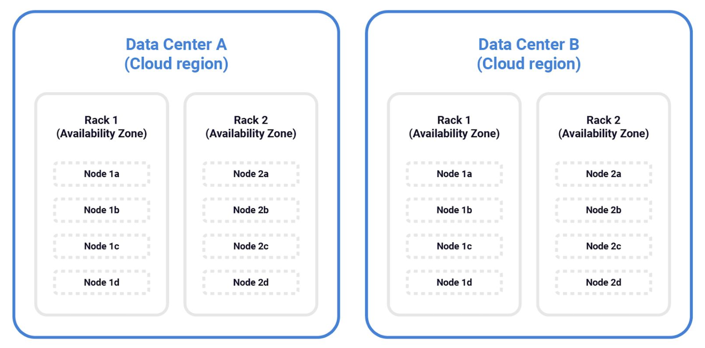
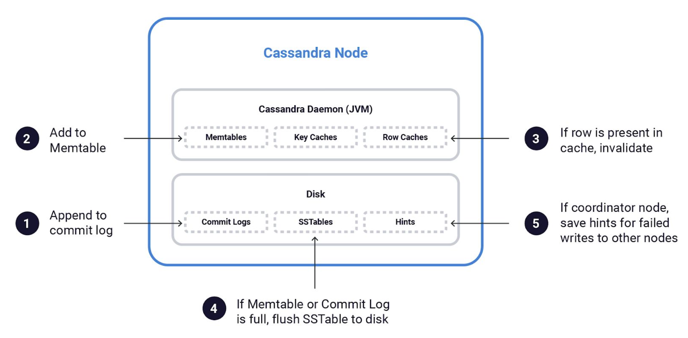
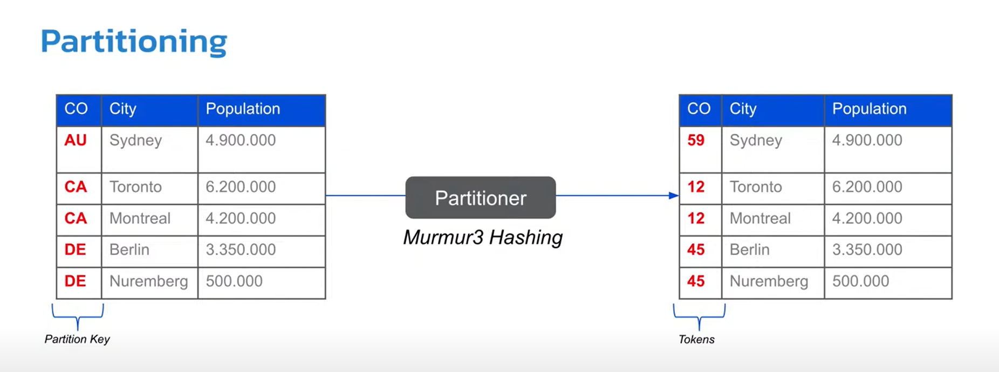

# Cassandra & MongoDB

> ***"Mélységes mély a múltnak kútja. Ne mondjuk inkább feneketlennek?"***

> ***"MongoDB is good. It works. However, it’s a somewhat specialized tool solving a somewhat specialized problem extremely well. It doesn’t solve all problems. Other problems are better solved with other data storage engines."***

> ***"Because of the way Cassandra is architectured, it's extremely good at certain use cases and extremely bad at others! I have used it in the past in various projects with great success. In particular, we had a project in King where our system had to support around 1,000,000 requests per second from all around the world. Cassandra could handle that without breaking a sweat. Good luck doing that with another database."***

> ***"With great power there must also come great responsibility" is a proverb popularized by Spider-Man in Marvel comics, films, and related media. One of the pain points of Cassandra is the fact that it needs careful maintenance. You need to have a good understanding of how Cassandra works internally. You need to maintain your data integrity and consistency. This requires analysing your cluster topology and running repair operations frequently.*** 

## Zipped

 - [ ] Apache Cassandra® is a free and open-source, distributed, wide column store, NoSQL database management system written in Java designed to handle large amounts of data across many commodity servers, providing high availability with no single point of failure.
 A Cassandra cluster is made up of multiple nodes. Cassandra nodes typically run on Linux® ​​and the only requirement to participate in a cluster is that the nodes are able to communicate with one another via a few well-known TCP/IP ports.

 - [ ] MongoDB is a free and open-source cross-platform document-oriented database program. Classified as a NoSQL database program, MongoDB uses JSON-like documents with schemata.

## Snippets

>    **Document-oriented** & **Wide column store** 
>    **scooter** & **car**


>  **..., or write your own**
 


## Előtörténet, hogyan alakultak ki
### Cassandra

> - In Greek mythology was a Trojan priestess (papnő)
> - Because of her beauty Apollo granted her the ability of prophecy but refusing Apollo, he put a curse on her so that all of her predictions
> would not be believed
> - Indicate a person whose accurate prophecies are not believed
> - Cassandra is the cursed (átok által sújtott) Oracle (jós)

			
Avinash Lakshman (Amazon's Dynamo), Prashant Malik  
**facebook** for inbox search feature
 - [x] 2008 -> Open-source project
 - [x] 2009 -> Apache Incubator project
		

### MongoDB
Most popular NoSQL database system
Developed by MongoDB Inc.  
Published: combination of the Server Side Public License and the Apache License
 - [x] 2007:  by **10gen** -> a component of a planned platform as a service product
 - [x] 2009: shifted to an open source development model
	

## Hol használjak őket?
### Cassandra 
 - [ ] Monzo (~Revolut)
 - [ ] ING Bank
 - [ ] OTP financial transactions 
### MongoDB
 - [ ] MetLife
 - [ ] Barclays
 - [ ] ADP
 - [ ] UPS
 - [ ] Viacom
 - [ ] New York Times

### Kiegészítés a Cassandra használatát illetően

**The ideal Cassandra application has the following characteristics:**
 - [ ] Writes exceed reads by a large margin
 - [ ] Data is rarely updated and when updates are made they are idempotent
 - [ ] Read Access is by a known primary key
 - [ ] Data can be partitioned via a key that allows the database to be spread evenly across multiple nodes
 - [ ] There is no need for joins or aggregates
  
**Some examples of good use cases for Cassandra are:**
 - [ ] Transaction logging: Purchases, test scores, movies watched and movie latest location
 - [ ] Storing time series data (as long as you do your own aggregates)
 - [ ] Tracking pretty much anything including order status, packages etc.
 - [ ] Storing health tracker data
 - [ ] Weather service history
 - [ ] Internet of things status and event history
 - [ ] Telematics: IOT for cars and trucks
 - [ ] Email envelopes—not the contents
	

#### Healthcare
The healthcare industry deals with large volumes of sensitive patient data, including electronic health records (EHRs), medical images, and other healthcare-related data. 
Ensuring that this data is secure, available, and easily accessible is essential for providing quality patient care.
Cassandra's flexible data model makes it an excellent choice for storing and managing healthcare data. 
Its ability to handle structured and unstructured data allows for easy integration with a wide range of healthcare applications, such as EHRs, medical 
imaging systems, and patient monitoring devices. This flexibility also enables healthcare providers to quickly adapt to changing data requirements and new data types.
In addition, Cassandra's distributed architecture and built-in fault tolerance make it a secure and reliable choice for storing sensitive patient data. 
Cassandra's peer-to-peer architecture ensures that there is no single point of failure, making it highly resilient in the face of hardware or network failures.
Cassandra’s ability to handle large amounts of data in real-time is particularly important for applications like patient monitoring, where data needs to be 
processed and analyzed quickly to provide timely insights into patient health.
Finally, Cassandra's tunable consistency model allows healthcare providers to choose the level of consistency that best fits their use case. 
Strong consistency can be used for critical patient data, while eventual consistency can be used for less critical data, such as patient demographics.

#### Credit Card info
Credit card information is a prefect use case for Cassandra as again we can take advantage of the wide rows to can easily view last n transactions. These transactions can be used to analyse fraud and even locate criminal activities around globe.
```
CREATE KEYSPACE IF NOT EXISTS transaction WITH REPLICATION = { 'class' : 'SimpleStrategy', 'replication_factor' : '1' };

CREATE TABLE transaction.credit_card_transactions (
	credit_card_no text,
	transaction_time timestamp,
	location text,
	issuer text,
	amount float,
	PRIMARY KEY (credit_card_no, transaction_time)
) WITH CLUSTERING ORDER BY (transaction_time DESC);

```

```
INSERT into transaction.credit_card_transactions (credit_card_no, transaction_time, location, issuer, amount) VALUES ('1234-9876-1918-5432', '2013-09-29 14:00', 'LONDON', 'NetFlix', 5.99);
INSERT into transaction.credit_card_transactions (credit_card_no, transaction_time, location, issuer, amount) VALUES ('1234-9876-1918-5432', '2013-10-12 21:00', 'LONDON', 'Amazon', 23.59);
INSERT into transaction.credit_card_transactions (credit_card_no, transaction_time, location, issuer, amount) VALUES ('1234-9876-1918-5432', '2013-10-13 23:00', 'LONDON', 'Pat's Dinner Diner', 29.27);
INSERT into transaction.credit_card_transactions (credit_card_no, transaction_time, location, issuer, amount) VALUES ('1234-9876-1918-5432', '2013-10-14 10:00', 'LONDON', 'Elephant Car Insurance', 200.00);

```
	
We can now check for common patterns which can show criminal activity. So let’s say that we know that 1000 customer’s credit cards have been using fraudulently
in the last day. We can check each of the credit cards for any commonalities. Let’s say that each of them have visited a certain food chain in the City of London. 
It would be possible to put  that merchant in a grey list for all future transactions. Also it may be that someone has been skimming the cards to create fake ones.


#### Balance updating
When we are processing usage of services such as utilities, credit cards, mobiles we don’t need to always update the users account balance at the same time as every transaction happens.
The solution is to update the balance at regular intervals to incorporate the new transactions.
For example, lets say we have 2 tables, 1 to hold the balance for a users account and a table for all transactions for a user. If we take the credit card example, we have

```
CREATE TABLE credit_card_transactions (
	credit_card_no text,
	transaction_time timestamp,
	account_no text,
	location text,
	issuer text,
	amount float,
	PRIMARY KEY (credit_card_no, transaction_time)
) WITH CLUSTERING ORDER BY (transaction_time DESC);

```

```
CREATE TABLE transaction.account_balance (account_no text,credit_card_no text,last_updated timestamp,balance double,PRIMARY KEY (account_no));
```

When we run the update balance process at regular intervals, the **last_updated** timestamp in the account_balance will act as the trigger for getting all the latest transactions to included in the new balance.  

So, lets imagine that every night at midnight we run an update process to update the balance of all credit cards. First we will look at the **last_updated** timestamp for the credit_card and use this in our WHERE clause to get all transactions for the credit card after that time.  

```
SELECT credit_card_no, last_udpated FROM account_balance WHERE account_no = 1001;
```

In theory we can have multiple cards per account but we will just use 1 for this example. We can now use the credit_card_no AND **last_updated** values from the above query to get the latest transactions to be added to the balance.

```
SELECT amount FROM credit_card_transactions WHERE credit_card_no = <credit_card_no> AND transaction_time > <last_updated>
```

To finish the update process we need to update the user’s balance with the old balance summed with the new transactions for that day. The important part of this is that we need to update the **last_updated** time to be the last transaction that we have processed.
So if we have the following transactions that were processed for that day:  

  

the **last_updated** time that will be updated in the accounts table will be 2013-10-12 23:00:00. 

This will ensure the entire process is idempotent so if there is any problem we can run the process again to get the same answer.  


#### ING Bank 
- [ ] Needs to manage vast amounts of customer data, including account information, transaction history, and personal details

> Apache Cassandra’s distributed architecture allows ING Bank to store and retrieve customer data efficiently and reliably across all web and mobile applications. It provides a flexible data model that can accommodate the evolving needs of the bank’s applications.
> 
> ING Bank also built their messaging platform with Apache Cassandra. This allows them to process real-time events and ensures guaranteed once delivery of all messages, enabling them to build applications that react quickly to changing market conditions and customer interactions.  [<https://planetcassandra.org/usecases/>]  

#### Monzo(~Revolut):
- [ ] Cassandra as a Core Database [PM: Bátor vállalkozás] 

> "We made the decision early on to use Cassandra as our main database for services, with each service operating under its own keyspace. This strict isolation between keyspaces meant that a service could not directly read data from another service."

_Handling failures on Cassandra_
- [ ] Can exist inconsistencies when reading the data from different nodes, which can be problematic for a banking service that requires consistency. 

> To address this issue, the team has been using a separate service running continuously in the background that is responsible for detecting and resolving inconsistent data states. This service can either flag the issue for further investigation or even automate the correction process. 

_Monzo experienced an incident in July 2019_ [<https://monzo.com/blog/2019/09/08/why-monzo-wasnt-working-on-july-29th#article>]  
- [ ] A configuration error in Cassandra during a scale-up operation forced a stop to all writes and reads to the cluster. 

> This event set off a chain reaction of improvements spanning multiple years to enhance the operational capacity of the database systems. Since then, Monzo has invested in observability, deepening the understanding of Cassandra and other production systems, and we are more confident in all operational matters through runbooks and production practices.
	
	
## Driver beállítások (timoutok, failover)
### Cassandra
DataStax Java Driver for Apache Cassandra®  
			
> #### Write path:
>  - [ ] convert the statement into a protocol-level Message (CqlRequestHandler constructor);
>  - [ ] find a node and a connection, and write the message to it (CqlRequestHandler.sendRequest);
>  - [ ] assign a stream id and wrap the message into a frame (InflightHandler.write);
>  - [ ] encode the frame into a binary payload (FrameEncoder).
> #### Read path:
>  - [ ] decode the binary payload into a frame (FrameDecoder);
>  - [ ] find the handler that corresponds to the stream id (InFlightHandler.channelRead);
>  - [ ] complete the client’s future (CqlRequestHandler.NodeResponseCallback.onResponse).
				
#### Need to track cluster state and metadata: administrative components
##### Control connection - dedicated DriverChannel instance to:
> - listen for server-side protocol events(topology events (NEW_NODE, REMOVED_NODE) and status events (UP, DOWN) )
> - way to query system tables
					
##### Metadata manager 
> -  responsible for maintaining the contents of `session.getMetadata()`
> -  follows the confined inner class pattern to ensure that all refreshes are applied serially, from a single admin thread
				
##### Topology monitor 
> Abstracts how we get information about nodes in the cluster
				
##### Node state manager
> Tracks the state of the nodes in the cluster
			
#### What to do when a request failed on a node 
- retry (same or other node)  
- rethrow  
- ignore  

When a query fails, it sometimes makes sense to retry it: the error might be temporary, or the query might work on a different node.  
The driver uses a retry policy to determine when and how to retry.  

The driver ships with two retry policies:  

- [ ] **DefaultRetryPolicy** (should be preferred in most cases as it only retries when it is perfectly safe to do so, and when the chances of success are high enough to warrant a retry)
- [ ] **ConsistencyDowngradingRetryPolicy** (In summary: only use this retry policy if you understand the consequences..)
- [ ] Use your own: specifying the name of a class that implements RetryPolicy
				
The policy has several methods that cover different error cases  
Each method returns a RetryVerdict (provides the driver with a RetryDecision to indicate what to do next)  
**Four possible retry decisions:**
- retry on the same node  
- retry on the next node in the query plan for this statement  
- rethrow the exception to the user code (as a failed future if using the asynchronous API)  
- ignore the exception, mark the request as successful, return an empty result set  
					
	**Hard-coded rules**
	cases where retrying is always the right thing -> hard-coded in the driver  
	 --errors before a network write was attempted (safe to retry: the request wasn’t sent -> driver moves to the next node in the query plan)  
    	- select a node   
		- borrow a connection from the host’s connection pool   
		- write the message to the connection  
						 						 
	errors that have no chance -> rethrown to the user  
						-QueryValidationException and any of its subclasses  
						-FunctionFailureException  
						-ProtocolError  

_Speculative query execution_  
Sometimes a Cassandra node might be experiencing difficulties (ex: long GC pause) and take longer than usual to reply. Queries sent to that node -> bad latency.  
One thing we can do-> start a second execution against another node, before the first replied/errored out  
If that second node replies faster -> response back to the client && cancel the first execution (discarding the response [in flight requests cancellation not supported])  
				
Request throttling
- Pass through(default)  
- Concurrency-based(Additional requests get enqueued up to the configured limit)    
					*max-concurrent-requests = 10000  
					*max-queue-size = 100000  
- Rate-based  
					*max-requests-per-second = 5000 (tracks the rate at which requests start, and enqueues when it exceeds the configured threshold)  
					*max-queue-size = 50000  
					*drain-interval = 1 millisecond (re-check the rate periodically and dequeues when possible)  
- write your own :)  
			

### Object mapper 
- [ ] removes boilerplate of writing queries: DAOs to access Apache Cassandra™   
- [ ] <https://github.com/DataStax-Examples/java-cassandra-driver-from3x-to4x/blob/master/example-4x/src/main/java/com/datastax/samples/SampleCode4x_CRUD_07_ObjectMapping.java>  

### JDBC wrapper of the Java Driver for Apache Cassandra® 
<https://github.com/ing-bank/cassandra-jdbc-wrapper>  
			
		
### MongoDB
Java Driver: official MongoDB driver for synchronous Java applications   
<https://github.com/mongodb/mongo-java-driver>

Reactive Streams Driver: asynchronous stream processing  
			
#### localThresholdMS:
When communicating with multiple instances of MongoDB in a replica set, the driver will only send requests to a server whose response time is less than or equal to the server with the fastest response time plus the local threshold, in milliseconds.  
Default: 15  

#### journal:
Specifies that the driver must wait for the connected MongoDB instance to group commit to the journal file on disk for all writes.  
Default: false  

#### w:
Write concern describes the level of acknowledgment requested from MongoDB for write operations to a standalone mongod, replica sets, or sharded clusters. In sharded clusters, mongos instances will pass the write concern on to the shards.  
				"majority" | <number> | <custom write concern name>  
				Default: 1 (write operation has propagated to the standalone mongod or the primary in a replica set.)  

#### retryWrites:
Specifies that the driver must retry supported write operations if they are unable to complete due to a network error.  
Default: true  
#### maxConnecting:
Specifies the maximum number of connections a pool may be establishing concurrently.  
Default: 2  
#### readPreference:
Read preferences describe the behavior of read operations with regards to replica sets. These parameters allow you to specify read preferences on a per-connection basis in the connection string.  
primary | primaryPreferred | secondary | secondaryPreferred | nearest  
primary: all reads use only the current replica set primary. If unavailable -> error/exception.  
Default: primary  
			

		
## Adatok tárolásának módja, formátuma
#### B-trees
Data is stored in a sorted manner, facilitating efficient range queries. This organization is akin to keeping books on a shelf in alphabetical order, making it easier to find a sequence of books by a particular author. The sorted nature of B-trees ensures that related data points are located near each other on the storage medium, optimizing the retrieval process. However, as the dataset size exceeds the memory capacity, the system may incur increased disk seeks, impacting performance.
#### LSM trees
Designed primarily for write efficiency, encounter challenges in data locality due to their multi-level storage mechanism. Data is dispersed across different levels, each with its own sorting order, which can complicate direct access patterns. Reading data might require aggregating information from multiple levels, akin to searching through several temporary collections to compile a complete set of works by a specific author. To mitigate these challenges, LSM trees employ mechanisms like bloom filters and caching, enhancing the efficiency of read operations despite the inherent complexity of their structure.
### Cassandra

A good way to understand Cassandra is to look at how clusters are physically deployed. Cassandra clusters are organized into nodes, racks, and data centers.  



- [ ] A ​node​ refers to a computer system running an instance of Cassandra. A node can be a physical host, a machine instance in the cloud, or even a Docker container
- [ ] A ​rack​ refers to a set of Cassandra nodes near one another. A rack can be a physical rack containing nodes connected to a common network switch. In cloud deployments, however, a rack often refers to a collection of machine instances running in the same availability zone
- [ ] A​ data center​ refers to a collection of logical racks, generally residing in the same building and connected by a reliable network. In cloud deployments, data centers generally map to a cloud region—for example, on AWS, us-west-1, and us-west-2

Cassandra typically stores copies of data across multiple data centers to ensure availability, while preferring to route queries to other nodes in the same data center to maximize performance.  

_Logical ring structure_  
Just as nodes, racks, and data centers describe how Cassandra clusters are physically deployed, the concept of a “ring” is commonly used to explain how data is organized logically.  

To decide where data is stored, the partition key is hashed to determine a token. A token is a 64-bit integer ID ranging from -2^63 to +2^63 that is used to identify each partition. The token value determines which Cassandra nodes the data will reside on.  

```
PRIMARY KEY((Partition Key), Clustering Keys) 
```
Each Cassandra node in the ring is assigned a range of token values.  
In earlier versions of Cassandra (before version 1.2), token ranges were manually assigned to nodes. A node claimed ownership of the range of values less than or equal to each token and greater than the token of the previous node.  

_Node-level architecture_  
The Cassandra daemon manages various in-memory and disk-based data structures. Commit logs are used to record writes to disk as a crash recovery mechanism. One of the reasons that writes in Cassandra are so fast is that all keyspaces share a common commit log, so as soon as a write appends data to the commit log on a replica, as far as the coordinator node is concerned, the write is considered complete.  

Sorted String Tables (**SSTables**) provide permanent on-disk storage for Cassandra.  
When Cassandra writes data, **SSTables** aren’t stored right away. This is because writes are stored in **Memtables** to maximize performance and are only flushed periodically to disk.  
Row caches and key caches are used to cache frequently accessed data to help with performance. For small tables, the entire table may be cached in memory.  

  

_How Cassandra writes data_  
- [x] When data is written to a node, it is first stored to the commit log so that the write can be recovered if the node fails
- [x] A copy of the data is also stored in the **memtable** where it is accessible for subsequent read operations or future updates without the need to go to disk
- [x] If the row cache is in use and there is an older copy of the row already in the cache, the old copy is invalidated and replaced with the new data value
- [x] In the background, Cassandra monitors the size of the **memtable**. If the **memtable** reaches a certain threshold size, Cassandra writes the **memtable** data to **SSTables** which are never deleted. Cassandra has a mechanism called compaction that runs periodically to consolidate **SSTables**.  

_Write performance_  
One of the most impressive features of Cassandra is its exceptional write performance. Cassandra can complete a write as soon as data is logged to the commit log while other operations happen asynchronously. Also, performance scales directly with the number of nodes in the cluster. Cassandra has been shown to deliver up to one million writes per second in production-scale clusters.  

> ​Cassandra delivers one million writes per second at Netflix - <https://medium.com/netflix-techblog/benchmarking-cassandra-scalability-on-aws-over-a-million-writes-per-second-39f45f066c9e>  

_How Cassandra reads data_  

Reads in Cassandra are more complicated than writes. The read operation begins when a client connects to a coordinator node with a read query. Like a write request, the coordinator node will use the partitioner to determine which nodes hold replicas of the data.  
Like writes, the performance of a read depends on the consistency required for the query. As a reminder, read consistency refers to the number of replicas that need to agree before a result is considered valid. If there is no consensus on a result, Cassandra will internally run a “read repair” operation, forcing Cassandra to update pending changes lingering on replicas before returning a result to the client.  
This is an example of how requiring strong consistency can affect performance. For each replica contacted during a read, Cassandra needs to perform several steps and combine results from the active **memtable** and potentially multiple **SSTables** as well.  

Figure describes the sequence of operations on each replica node:  
  

- [x] When querying a replica, the first place to look is in the row cache. If the needed data is available in the row cache, it can be returned immediately
- [x] Next, Cassandra will check the key cache (if enabled). If the partition key is found in the key cache, Cassandra can use the key to learn where data is stored by reading an in-memory compressed offset map
- [x] Next, Cassandra will check the **memtable** to see if the required data is present
- [x] After this, Cassandra fetches data from **SSTables** on disk and combines it with data from the **memtable** to construct an up-to-date view of the data queried
- [x] Finally, if row caching is enabled, Cassandra will store the data in the row cache (to accelerate subsequent reads of the same data) and return results to the coordinator node

> These steps are slightly simplified. Cassandra has additional optimizations such as in -memory **bloom filters** that can speed up the process of partition key lookups by narrowing the pool of keys to search  

_A typical customer problem_  

Consider the example of a DB managing millions of customer accounts. Focus on just two tables:  
A ​customer table​ maintains a list of all ​customers. Contains details like the customer’s unique ID, name, encrypted password, etc.  
A​ customer_transactions table​ logs a record every time a customer makes any kind of transaction: purchases, transfers, etc.  
Now imagine a service with ten million user accounts where each user has logged an average of 1000 transaction events, each approximately 1 KB in size. This works out to ten TB of data in the customer_transactions table alone, and that’s before replication and assuming no overhead.  

It appears that customer names and email addresses are being stored redundantly, but as we’ll see shortly, this is just a matter of how CQL presents tabular data views. Cassandra supports static columns ​​where a single value is associated with each partition key.  

**cust_id** | **cust_name** | **cust_email** | **event_time** | **event_type** | **...**
---------|----------|---------|---------|---------|---------
Aj50nT63 | Barney Rubble | rubble@hotmail.com | 2018.06-02T19:42:28 | purchase  
kTe82rn2 | Fred Flinstone | fred@gmail.com | 2018-06-02T19:42:31 | transfer    
rTq59vd6 | Joe Rockhead | joer@yahoo.com | 2018-06-02T19:42:38 | purchase    
N6pDgQ5G | Wilma Flinstone | wilma@bedrock.org | 2018-06-02T19:43:02 | purchase    
kTe82rn2 | Fred Flinstone | fred@gmail.com | 2018-06-02T19:43:55 | refund    
Aj50nT63 | Barney Rubble | rubble@hotmail.com | 2018-06-02T19:44:01 | refund    
rTq59vd6 | Joe Rockhead | joer@yahoo.com | 2019-03-11T06:24:03 | transfer   

_Scaling Cassandra_  
One of the biggest challenges that database administrators inevitably run into is the need to scale their database. Databases may need to grow for several reasons:  
- [ ] The amount of data is growing, and data partitions on cluster nodes are filling up
- [ ] Transaction volumes are growing, and it would be useful to distribute transactions across more cluster nodes for added performance
- [ ] Data access patterns are changing

_Rules of a Good Partition_  
- [x] Store together what you retrieve together
- [x] Avoid big partitions  
	● Up to 2 billion cells per partition  
	● Up to ~100k rows in a partition  
	● Up to ~100MB in a Partition   
- [x] Avoid hot partitions  
PRIMARY KEY (user_id) vs. PRIMARY KEY ((country), user_id);  
				
```
public class SkipListMemtable
{
	...
	private final ConcurrentNavigableMap<PartitionPosition,AtomicBTreePartition(Token,BTree)> partitions = new ConcurrentSkipListMap<>();
	...
}
```
Cassandra data is partitioned based on the Token of row's PartitionKey. The token is gerenated using a Hash Function.   

Hashing with the Murmur3Partitioner:  


Cassandra offers the following partitioners that can be set in the cassandra.yaml file:  
- [ ] Murmur3Partitioner (default): uniformly distributes data across the cluster based on MurmurHash hash values.
- [ ] RandomPartitioner: uniformly distributes data across the cluster based on MD5 hash values.
- [ ] ByteOrderedPartitioner: keeps an ordered distribution of data lexically by key bytes

The Murmur3Partitioner is the default partitioning strategy for Cassandra 1.2 and later new clusters and the right choice for new clusters in almost all cases. However, the partitioners are not compatible and data partitioned with one partitioner cannot be easily converted to the other partitioner.  

> One such fastest hash algorithm is the **MurmurHash**, which has gained widespread popularity due to its impressive speed and minimal computational resources. **MurmurHash** is a non-cryptographic hash function that delivers exceptional performance and a low collision rate. It is particularly suitable for use in hashing non-critical data such as database keys, cache hashes, or network protocol checksums. Another contender in the race for the fastest hash algorithm is **CityHash**, developed by Google engineers. **CityHash** offers remarkable speed and quality, making it ideal for applications requiring large-scale, parallel processing. It is also highly adaptable, allowing developers to optimize the algorithm according to specific hardware configurations. [<https://locall.host/which-hash-algorithm-is-fastest/>]  

```
Assume you're trying to locate where the rows corresponding to the usernames abcd and abce and abcf are stored.  

The hex representation of these strings are:
- 0x61626364 
- 0x61626365 
- 0x61626366

Assuming we apply this MurmurHash3 implementation on both strings we get: 
- 0x43ED676A
- 0xE297E8AA
- 0x87E62668 

So, in the case of MurmurHash3, the tokens of the strings will be these 3 values, while in the case of the ByteOrderedPartitioner the tokens will be the raw data values themselves: 
- 0x61626364
- 0x61626365 
- 0x61626366

```
Cassandra's current memtable implementation uses a hierarchy of comparison-based data structures to organize data:  
- [ ] a concurrent skip list is used to index database partitions
- [ ] separate B-Trees are used to index rows within a partition, columns within a row, and individual cells within a complex column

```
public abstract class DecoratedKey
{
	private final Token token;
	...
}
```

```
public final class AtomicBTreePartition extends AbstractBTreePartition
{
	protected final DecoratedKey partitionKey; (Token)
	private volatile BTreePartitionData ref; (BTree)
	...
}
```

**Extract from the org.apache.cassandra.utils.btree.BTree.java class ~4197 lines** 


```
public class SkipListMemtable
{
    // We index the memtable by PartitionPosition only for the purpose of being able
    // to select key range using Token.KeyBound. However put() ensures that we
    // actually only store DecoratedKey.
    private final ConcurrentNavigableMap<PartitionPosition, AtomicBTreePartition> partitions = new ConcurrentSkipListMap<>();
	...
}
```

```
    /*
     * A token corresponds to the range of all the keys having this token.
     * A token is thus not comparable directly to a key. But to be able to select
     * keys given tokens, we introduce two "fake" keys for each token T:
     *   - lowerBoundKey: a "fake" key representing the lower bound T represents.
     *                    In other words, lowerBoundKey is the smallest key that
     *                    have token T.
     *   - upperBoundKey: a "fake" key representing the upper bound T represents.
     *                    In other words, upperBoundKey is the largest key that
     *                    have token T.
     *
     * Note that those are "fake" keys and should only be used for comparison
     * of other keys, for selection of keys when only a token is known.
     */
	 
	 
    /*
     * For each token, we needs both minKeyBound and maxKeyBound
     * because a token corresponds to a range of keys. But the minimun
     * token corresponds to no key, so it is valid and actually much
     * simpler to associate the same value for minKeyBound and
     * maxKeyBound for the minimun token.
     */
	 

```
		
### MongoDB
Supports pluggable storage engines -> utilizes memory differently   
- [ ] in-memory storage engine -> active data only in memory 
- [ ] default: WiredTiger storage engine [[source.wiredtiger.com](source.wiredtiger.com)] (MongoDB 3.2 <)   
				*comes in both B-tree and LSM configurations  
				*however, MongoDB ships WiredTiger in only B-tree configuration keeping it simple for users  
				*uses MultiVersion Concurrency Control (MVCC)   
				 At the start of an operation -> provides a point-in-time snapshot of the data to the operation  
				 Snapshot -> a consistent view of the in-memory data  
				*When writing to disk, WiredTiger writes all the data in a snapshot to disk (consistent way across all data files)  
			
**durability: Journal + Checkpoint**
- [ ] Journal:
	For each write -> MongoDB writes the changes into Journal files (~transaction log files, which is basically a WAL mechanism used by MongoDB
- [ ] Checkpoint:
	Create checkpoints -> write the snapshot data to disk  
	At every checkpoint interval (Def. 60 sec), MongoDB flushes the changes in the cache to their respective data files  


```
			/*
			 * __wt_bloom_inmem_get --
			 *     Tests whether the given key is in the Bloom filter. This can be used in place of
			 *     __wt_bloom_get for Bloom filters that are memory only.
			 */
			int
			__wt_bloom_inmem_get(WT_BLOOM *bloom, WT_ITEM *key)
			{
				uint64_t h1, h2;
				uint32_t i;

				h1 = __wt_hash_fnv64(key->data, key->size);
				h2 = __wt_hash_city64(key->data, key->size);
				for (i = 0; i < bloom->k; i++, h1 += h2) {
					if (!__bit_test(bloom->bitstring, h1 % bloom->m))
						return (WT_NOTFOUND);
				}
				return (0);
			}

```

**Image from the BTree implementation of the Wired Tiger Storage Engine**
	
	
## Tesztelés
### Cassandra
	- [ ] Monzo(~Revolut), ING Bank, financial transactions.. <-> org.apache.cassandra.utils.btree.BTree.java ~4197 lines 
	- [ ] High degree of confidence for every commit:   
				- the database is working as expected   
				- not only for an exact set of operations (unit & integration tests)   
				- potentially for any use-case & combination of operations   
				- under circumstances comparable to production  
	- [ ] Harry  
				- combine stress & integration-testing tools  
				- <https://issues.apache.org/jira/browse/CASSANDRA-16453>  
				- <https://cassandra.apache.org/_/blog/Harry-an-Open-Source-Fuzz-Testing-and-Verification-Tool-for-Apache-Cassandra.html>  
			
		
			
## Lekérdező nyelv
### Cassandra
Introduced the Cassandra Query Language (CQL). CQL is a simple interface for accessing Cassandra, as an alternative to the traditional Structured Query Language (SQL).  
			
```
    CREATE KEYSPACE IF NOT EXISTS transaction WITH REPLICATION = { 'class' : 'SimpleStrategy', 'replication_factor' : '1' };

    CREATE TABLE transaction.credit_card_transactions ( credit_card_no text, transaction_time timestamp, location text, issuer text, amount float, PRIMARY KEY (credit_card_no, transaction_time) )  WITH CLUSTERING ORDER BY (transaction_time DESC);

    INSERT into transaction.credit_card_transactions (credit_card_no, transaction_time, location, issuer, amount) VALUES ('1234-9876-1918-5432', '2013-09-29 14:00', 'LONDON', 'NetFlix', 5.99);
	
    SELECT * FROM transaction.credit_card_transactions;
```		

## Tranzakció támogatás
### Cassandra
- [ ] Atomic, isolated, durable transactions. AID. C?  
- [ ] Eventual/tunable consistency: lets the user decide how strong or eventual they want each transaction’s consistency to be  

**Tunable consistency**
In distributed databases, it takes time for updates to propagate across networks to remote cluster nodes. Unlike an RDBMS, which can guarantee consistency (at the expense of performance and scalability), distributed databases are usually “eventually consistent.”  
An underrated feature of Cassandra is that it provides tunable consistency, allowing users to manage the trade-off between data consistency and performance. Consistency can be managed globally or can be adjusted for individual read and write operations.  

##### ATOMICITY
- [ ] Write: 
- Atomic at partition level (insertions or updates of two or more rows in the same partition are treated as one write operation)  
- If multiple client sessions update the same columns in a row concurrently, the most recent update is the one seen by readers  

##### ISOLATION
- [ ] Write and delete operations are performed with full row-level isolation   
write to a row within a single partition on a single node is only visible to the client performing the operation (until it is complete)  

##### DURABILITY
- [ ] Writes are recorded:   
in memory and to the commit log on disk before they are acknowledged as a success 
- [ ] Crash/server failure before the memtables are flushed to disk:   
the commit log is replayed on restart to recover any lost writes
		
### MongoDB
- [ ] Except schema operations, WiredTiger performs all the read and write operations within a transaction
- [ ] If the user doesn't explicitly begin a transaction, WiredTiger will automatically create a transaction for the user's operation
- [ ] One transaction/session at a time & that must complete before another transaction can be started
- [ ] Every session is singly-threaded -> all the operations in the transaction -> same thread
			
##### ATOMICITY
- [ ] All write operations in memory 
- [ ] Will not be written to disk until the entire transaction is committed -> size of the transaction must fit in memory  
					*There is one case that atomicity of transactions is not honored..  
					*There is another case that atomicity may be violated if a transaction operates..  
				
##### ISOLATION
WiredTiger supports three isolation levels:  

-**read uncommitted** (able to see updates done by all the existing transactions, including the concurrent ones)
-**read committed** (able to see updates done by other transactions that have been committed when the reading happens)
-**snapshot** [default] (able to see updates done by other transactions that are committed before it starts)   
*write operations -> the only supported  
*guarantees repeated reads -> same result except: in one scenario using timestamps  
					  
##### VISIBILITY
To read a key -> traverses all the updates of that key still in memory(linked list with the newest update at the head)   
				no value is visible -> checks on the disk (version chosen to be written to disk in the last reconciliation)   
					still invisible -> search the history store to check if there is a version visible to the reader there  

##### DURABILITY
*commit level: If Logging is enabled on the table.   
After commit -> guaranteed to survive restart  
				
*checkpoint level: change survives restart <- included in the last checkpoint(successful)  
				
Prepared Transactions:  
				for implementing distributed transactions through two-phase commit (only work under snapshot isolation)  
				+phase: prepared phase   
					before rollback/commit phase  
				After prepare -> no more read/write on the transaction  
				A two-phase distributed transaction algorithm can rely on the prepared state to reach consensus among all the nodes for committing  

Folytatás innen: https://source.wiredtiger.com/develop/arch-timestamp.html  
Illetve ez is jó lenne még hozzá, ha belefér: https://www.mongodb.com/docs/manual/core/transactions-production-consideration/#outside-reads-during-commit  
			

			
## Isolation/locking mechanikák
### Cassandra	
Does not use RDBMS ACID transactions with rollback or locking mechanisms, but instead offers atomic, isolated, and durable transactions   
with eventual/tunable consistency that lets the user decide how strong or eventual they want each transaction's consistency to be  
			
## Skálázhatóság
### Cassandra
#### Vertical scalability
increasing the capacity of a single machine or node (upgrading hardware such as RAM, CPU, storage) However, vertical scalability   
				can be costly and resource-intensive: acquiring and operating more powerful hardware comes with financial investments  
				migrating to a new system with increased capacity requires careful planning and effort, especially for transferring large volumes of data  
		
#### Horizontal scalability
adding more machines or nodes, workload is distributed across multiple machines  
Based on nodes, using lower commodity hardware   
double capacity/throughput -> double the number of nodes  
This linear scalability applies essentially indefinitely  
has become one of Cassandra’s key strengths  
	
## Támogatott feature-ok
		TBD

## Érdekességek Cassandra oldalról

avagy eme előadások vázlata..  

https://www.youtube.com/watch?v=xF5y_n9viv8  
https://youtu.be/xF5y_n9viv8?t=4028  
https://www.youtube.com/watch?v=ZYnWVOY6EWk  
		
- [ ] Decentralised
- [ ] Linear upscale
- [ ] Petabytes of data
- [ ] Customers don't wait-> competitors
- [ ] No single point of failure, downtime ~ impossible
- [ ] Important the role of the client: smart reconnection, retry, failover
- [ ] DataStax gave a lot, but it is not owned by the company 
- [ ] Redis is super fast while operating in memory
- [ ] MongoDB has more bottleneck in case of failure
- [ ] Disk space is free. Your reputation is expensive..
- [ ] SSD recommended
- [ ] AP or CP also can be. (Money vs profile image) -> Each statement can have unique consistency level set
- [ ] Mix: high on write or high on read - ONE confirmation is enough or ALL when we wait for all acks.
- [ ] Slower -> higher consistency
- [ ] Fast -> lower cons. level
- [ ] Each app will have different cons. levels for read/write. Can we deal with stale data?
- [ ] Big partition size, problems when addig/removing nodes (servers) in data centers due to high volume of data to be transfered
- [ ] Avoid big and constantly growing partitions.(png)
- [ ] Too many partition is not a problem.
- [ ] Hot partitions to be avoided: eg. video_id -> uneven

## Források

https://medium.com/@mndpsngh21/understanding-the-log-structured-merge-lsm-tree-a-deep-dive-into-efficient-data-storage-d7ef3a7562ba
~~The performance of the in-memory buffer determines the peak write throughput that the database as a whole can achieve, while the amount of data that can be placed in it is a primary determinant of the achievable sustained throughput, as larger buffers enable a lower number of subsequent compaction passes over the data.~~
~~The general format is: PRIMARY KEY((Partition Key), Clustering Keys) Where when there are no parenthesis, the first column is assumed to be the partition key. ~~

## Egyebek

- [ ] Nagyon sok idő és nagyon sok helyről származó információ avagy nézőpont megimserése kellett ahhoz, hogy átlássak a világ nyolcadik csodájának beállított Cassandrán..
- [ ] Eleve van egy Datastaxunk (Astra), ami a teljesen független Cassandrát nagyon erősen tolja és marketingeli. A könnyen elérhető anyagok a Cassandráról beleértve még a fórumok bejegyzéseinek többségét is, erősen át vannak itatva az előbb említett cég érdekeivel.
- [ ] Jelenleg a Cassandra 5.0-s verziónál járunk, de ne veszítsük szem elől, hogy ez egy BETA1 verzió. Eme verzió egy viszonylag nagy mérföldkőnek tűnik a Cassandra életében, aminek van nyilván egy bumeráng hatása is, hiszen ők maguk hozzák felszínre azokat a gyenge pontokat, amiket az 5.0 orvosolni szeretne. Bő fél éve, még az ACID fogalmat is összekötötték ezzel a verzióval. Egy távolról jött ember számára kecsegtető ezt hallani, de tudjuk, hogy a történelem az élet tanítómestere. 
- [ ] Utóbbi verziók kezdtek már el támogatni olyan ígéretesnek tűnő feature koszorút, amiben láthattunk pehelysúlyú tranzakciót, kötegelt utasítás végrehajtást és egyéb szép dolgokat, de mára már a napnál is világosabb, hogy gyakorlatilag érdemben senki sem használja őket. Olyan árat kellene értük fizetni, ami alapjaiban törné össze azt a víziót, amit a Cassandra képvisel már a kezdetek óta.
- [ ] Szintén nagy volt a csábítás, mikor a Cassandra honlapján végigolvastam az esettanulmányok menüpontban összegyűjtött "From startups to the largest enterprises, the world runs on Cassandra" igen hosszú és széles spektrumú beszámolóit.
- [ ] Ezek közt is van egy hatalmas kakukktojás, a Monzo. Ha nagyon leegyszerűsítem, akkor tekinthetjük egy kisebb Revolutnak is. És ott virít a mondat, hogy elsődleges adatbázisnak a Cassandrát választották. Elsőre kicsit ijesztő és hihetetlen volt, de valóban ez a helyzet. Ahol a tranzakció, mint fogalom is értelmezhetetlen, elkezdünk tárolni ügyfél/pénzügyi adatokat.
Egyedül egy mutex amit fel tudunk mutatni Cassandra oldalról, de azért valljuk be, ez sokra nem jogosít fel minket. 
Elég sok anyagot próbáltam átolvasni, hogy kicsit jobban belelássak a részletekbe és némi kitartás után rábukkantam egy beszélgetés leiratának, ami által azért kicsit jobban beláthattam már a kulisszák mögé.
- [ ] Szóval Monzóék a józan észnek nem ellentmondva, bizony keményen körülbástyázták Cassandra jósnőnket megfelelő failover, lockolást biztosító és egyéb folyamatokkal.
Így azért már hihetőbb a teljes kép. 